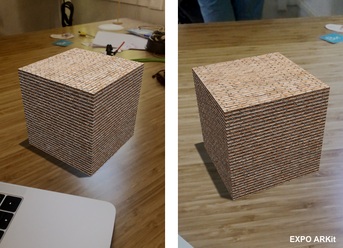

# ARKit Lighting & PBR in React Native

## Making things look real!!


As you may know, Three.js was made centuries ago by the [legendary Mr. Doob.](https://twitter.com/mrdoob) And Expo ARKit support was slapped together by me while mostly watching South Park.

Somehow these two libraries work insanely well together. This becomes apparent when you set up realistic augmented reality lighting and it works out of the box.

> PBR = Physically-Based Rendering = Things look like real life


<Snack data-snack-id="@bacon/ar-pbr" />

## Getting Started

This tutorial assumes you know how Expo AR works. If you don’t, here’s a beginner tutorial:
[**ARKit in React Native Tutorial: The Basics**
*By now you’ve probably seen some of the crazy things people have been making with ARKit. If you want to make AR stuff…*blog.expo.io](https://blog.expo.io/arkit-in-react-native-tutorial-the-basics-9f839539f0b9)

In today’s tutorial, we’ll be focusing on a few concepts:

- **Setting up PBR & Shadows in three.js**

- **Using ARKit Light Estimation to change our lighting properties**

- **Creating a model with a complex texture**

## Shadows

First, add the shadows prop to our GraphicsView:

```js
<GraphicsView
  ...
  isShadowsEnabled={true}
  />
```

To get shadows to render we need to enable gamma in/out, and activate the renderer shadow map:

```js
renderer.gammaInput = true;
renderer.gammaOutput = true;
renderer.shadowMap.enabled = true;
```

> The Gamma flags let our renderer know that all textures are input/output with premultiplied gamma.

### Physically-Based Rendering

PBR is very simple in three.js. We let the renderer know that we want the lights to be physically correct, and define a tone map.

```js
this.renderer.physicallyCorrectLights = true;
this.renderer.toneMapping = THREE.ReinhardToneMapping;

// to allow for very bright scenes.
// this.renderer.toneMappingExposure = Math.pow(0.68, 5.0);
```

> A “Tone Map” is used to approximate the appearance of HDR (high dynamic range) on low dynamic screens like your phone or tablet.

## Lighting

There are three main lights we need to focus on to get PBR working:

- **Ambient Light:** The general lighting that all objects receive. As far as lights go, think of it as the: “participation award” light. 😜

- **Directional Light:** This is used for shadow, it can be upsetting if you don’t know how to use it, hopefully that doesn’t happen.

- **Point Light:** This is, finally, where we apply the dynamic ARKit light estimation. A point light will be used for our dynamic lighting system.

ARKit returns two main values for dynamic light estimation; they are, more or less:

- Kelvin: Used for setting the color of the light, according to an odd but cool color ramp.

- Lumens: The brightness / intensity of the light.

In expo-three I’ve included a node called AR.Light that extends Point Light and automatically takes care of converting these values. 💡 If you like learning , then here’s the source:
[**Light.js**
*expo-three - Utilities for using THREE.js on Expo*github.com](https://github.com/expo/expo-three/blob/master/lib/AR/Light.js)

## Coding the Lights

We want our mesh to look real in all lights; to do this we just have to add a few things.


### Basic ambient light

```js
scene.add(new THREE.AmbientLight(0x404040));
```

### Shadow light

Shadow Light is a little more involved. We want to define the size of the shadow map to be only as big as we need. Rendering shadows is expensive so you should exercise caution.

```js
let light = new THREE.DirectionalLight(0xffffff, 0.6);
light.castShadow = true;
// default is 50 - meters for resolution, massive memory hog
const shadowSize = 1;
light.shadow.camera.left = -shadowSize;
light.shadow.camera.right = shadowSize;
light.shadow.camera.top = shadowSize;
light.shadow.camera.bottom = -shadowSize;
light.shadow.camera.near = 0.001;
light.shadow.camera.far = 100;
light.shadow.camera.updateProjectionMatrix();
...
scene.add(this.shadowLight);
scene.add(this.shadowLight.target);
```

That frustrating thing I was telling you about is in regards to shadow light positioning. If you set the position it will move one side of the direction, but keep the other side stuck at the center. This means that the shadow won’t have full coverage. Luckily there is a shadowLight.target prop, easy just set that position…it didn’t work?…you need to add it to the scene :[ That was the hardest part, so kick back :)

### Dynamic light

Next we want to add our dynamic AR Light. It’s important that we also call `point.update()` each frame so it will get the newest estimation from ARKit:

```js
const point = new ThreeAR.Light();
point.position.y = 2; // 2 Meters = 6.56168 Feet ;)
...
// In a frame loop
point.update()
```

## Complex Texture


If we want something to look real in 3D, we need to apply a couple different textures. The standard set of textures used to make something look nice are as follows:

- **Diffuse**: The most common kind of map. This is used for defining color or images. Most of the time we only use the Diffuse map.

- **Normal**: This purple-blue image is used to define bumps, and lighting in your model.

- **Specular**: Used to define the textures shiny parts and highlight colors.

In this tutorial, we rely on some built-in features of three.js to get around having to manually tweak values.

```js
const diffuseAsset = await AssetUtils.resolveAsync(
  "https://github.com/mrdoob/three.js/blob/master/examples/textures/brick_diffuse.jpg?raw=true"
);
const diffuse = await ExpoTHREE.loadAsync(diffuseAsset);
diffuse.wrapS = THREE.RepeatWrapping;
diffuse.wrapT = THREE.RepeatWrapping;
diffuse.anisotropy = 4;
diffuse.repeat.set(1, 1);

const bumpAsset = await AssetUtils.resolveAsync(
  "https://github.com/mrdoob/three.js/blob/master/examples/textures/brick_bump.jpg?raw=true"
);
const bumpMap = await ExpoTHREE.loadAsync(bumpAsset);
bumpMap.wrapS = THREE.RepeatWrapping;
bumpMap.wrapT = THREE.RepeatWrapping;
bumpMap.anisotropy = 4;
bumpMap.repeat.set(1, 1);

const roughnessAsset = await AssetUtils.resolveAsync(
  "https://github.com/mrdoob/three.js/blob/master/examples/textures/brick_roughness.jpg?raw=true"
);
const roughnessMap = await ExpoTHREE.loadAsync(roughnessAsset);
roughnessMap.wrapS = THREE.RepeatWrapping;
roughnessMap.wrapT = THREE.RepeatWrapping;
roughnessMap.anisotropy = 4;
roughnessMap.repeat.set(9, 0.5);

const cubeMat = new THREE.MeshStandardMaterial({
  roughness: 0.7,
  bumpScale: 0.002,
  metalness: 0.2,
  map: diffuse,
  bumpMap,
  roughnessMap,
});
```


Apply this to a cube and tell it to cast shadows:

```js
mesh.castShadow = true;
```

Now, the last thing we need is something to receive the shadow. It has to be transparent, though…well, that’s why `ExpoTHREE.AR.ShadowFloor()` exists :) Just add it to your scene and you’re good to go! We’ll also use our dynamic light to set the shadow depth.

```js
const shadowFloor = new ExpoTHREE.AR.ShadowFloor({
  width: 1,
  height: 1,
  opacity: 0.6, // The shadow depth
});
scene.add(shadowFloor);
...
//in a frame loop
shadowFloor.opacity = this.arPointLight.intensity;
```

Aight, now you’ve created light, shadows, and you’re rendering something that looks arguably pretty real!

## Thanks for reading

Hope this helps — let me know in the comments below if something deprecates!
[**Evan Bacon 🥓 (@Baconbrix) | Twitter**
*The latest Tweets from Evan Bacon 🥓 (@Baconbrix). 20💙Building dope apps for @expo🔥 Lego master builder😱Son of…*twitter.com](https://twitter.com/baconbrix)
[**expo/expo-three**
*expo-three — Utilities for using THREE.js on Expo*github.com](https://github.com/expo/expo-three)
[**AR — Expo Documentation**
*SDK API Reference Introduction AR Accelerometer Admob Amplitude AppLoading ART Asset Audio AuthSession AV…*docs.expo.io](https://docs.expo.io/versions/latest/sdk/AR)
