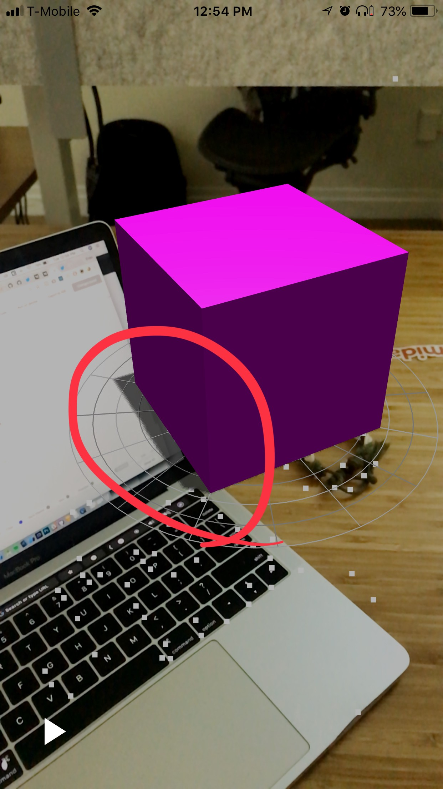

# ARKit Shadows in React Native

## How to cast shadows on make-believe surfaces.

Today I’ll show you how to make 3D objects cast shadows on the real-world ground!

](./images/12x0MmETAOlsoSSrA5qC9Gw.png)_[No Shadow Floor | Shadow Floor — from expo-three/example/AR/Model](https://github.com/expo/expo-three/tree/master/example)_

In expo-three, I included a mesh called `[ShadowFloor`](https://github.com/expo/expo-three/blob/master/lib/AR/ShadowFloor.js). [ShadowFloor](https://github.com/expo/expo-three/blob/master/lib/AR/ShadowFloor.js) is a `THREE.Plane` mesh that has a special transparent texture applied to it. This texture will receive a shadow without actually displaying any other content on it.

We can stick this mesh on any surface and use it to make our AR Scene come to life!

<Snack data-snack-id="@bacon/ar-shadows" />

_Floating shadows break my brain_

## Setting things up

This tutorial assumes that you know how AR works in Expo; if you need to refresh, I have some basic tutorials on it:
[**ARKit in React Native Tutorial: The Basics**
*By now you’ve probably seen some of the crazy things people have been making with ARKit. If you want to make AR stuff…*blog.expo.io](https://blog.expo.io/arkit-in-react-native-tutorial-the-basics-9f839539f0b9)

Now after our context loads, we’ll enable shadows in our renderer:

```
// renderer = new ExpoTHREE.Renderer(...)
...
renderer.gammaInput = true;
renderer.gammaOutput = true;
renderer.shadowMap.enabled = true;
```

## Lighting

There are two main lights we need for making shadows:

- **Ambient — **The general lighting that all objects receive (the participation award of the lighting world)

- **Directional —** This is used for creating shadows: think of it as a vector, where the position is the end point and `light.target.position` is the starting point.

### Coding the Lights

Add a simple ambient light that emits a gray light equally over everything:

```
scene.add(new THREE.AmbientLight(0x404040));
```

Now we need to add a directional light for our shadow:

```
let light = new THREE.DirectionalLight(0xffffff, 0.6);
light.castShadow = true;
// default is 50 - meters for resolution, massive memory hog
const shadowSize = 1;
light.shadow.camera.left = -shadowSize;
light.shadow.camera.right = shadowSize;
light.shadow.camera.top = shadowSize;
light.shadow.camera.bottom = -shadowSize;
light.shadow.camera.near = 0.001;
light.shadow.camera.far = 100;
light.shadow.camera.updateProjectionMatrix();
...
scene.add(this.shadowLight);
scene.add(this.shadowLight.target);
```

Rendering shadows is pretty expensive; we want to create only just enough of a map to cover our scene, and then we’ll move the light around to keep our scene lit. **Notice** that if you don’t add the `shadowLight.target` to the scene, then you cannot move the starting point of the light.

Let’s add a cube that casts a shadow. Any node will work; just remember to add `cube.castShadow = true;`.

```
*// Make a cube - notice that each unit is 1 meter in real life, we will make our box 0.1 meters
*const geometry = new THREE.BoxGeometry(0.1, 0.1, 0.1);
*// Simple color material
*const material = new THREE.MeshPhongMaterial({
  color: 0xff00ff,
});
*// Combine our geometry and material
*this.cube = new THREE.Mesh(geometry, material);
*// Remember to activate shadows!!
*this.cube.castShadow = true;
```

Finally, we need something to receive the shadow. Let’s create that special `ShadowFloor` node and add it to the scene:

```
const shadowFloor = new ExpoTHREE.AR.ShadowFloor({
  width: 1,
  height: 1,
  opacity: 0.6, // The shadow density
});
scene.add(shadowFloor);
```

That’s all it takes to add shadows to your AR scene!

FYI the ARKit API [isn’t quite as efficient](https://stackoverflow.com/questions/48090797/how-to-add-a-shadow-plane-and-the-difference-between-the-scn-file-apple-provide).

## Thanks for reading

Hope this helps! Let me know in the comments below if something deprecates!
[**Evan Bacon 🥓 (@Baconbrix) | Twitter**
*The latest Tweets from Evan Bacon 🥓 (@Baconbrix). 20💙Building dope apps for @expo🔥 Lego master builder😱Son of…*twitter.com](https://twitter.com/baconbrix)
[**expo/expo-three**
*expo-three - Utilities for using THREE.js on Expo*github.com](https://github.com/expo/expo-three)
[**AR - Expo Documentation**
*SDK API Reference Introduction AR Accelerometer Admob Amplitude AppLoading ART Asset Audio AuthSession AV…*docs.expo.io](https://docs.expo.io/versions/latest/sdk/AR)
