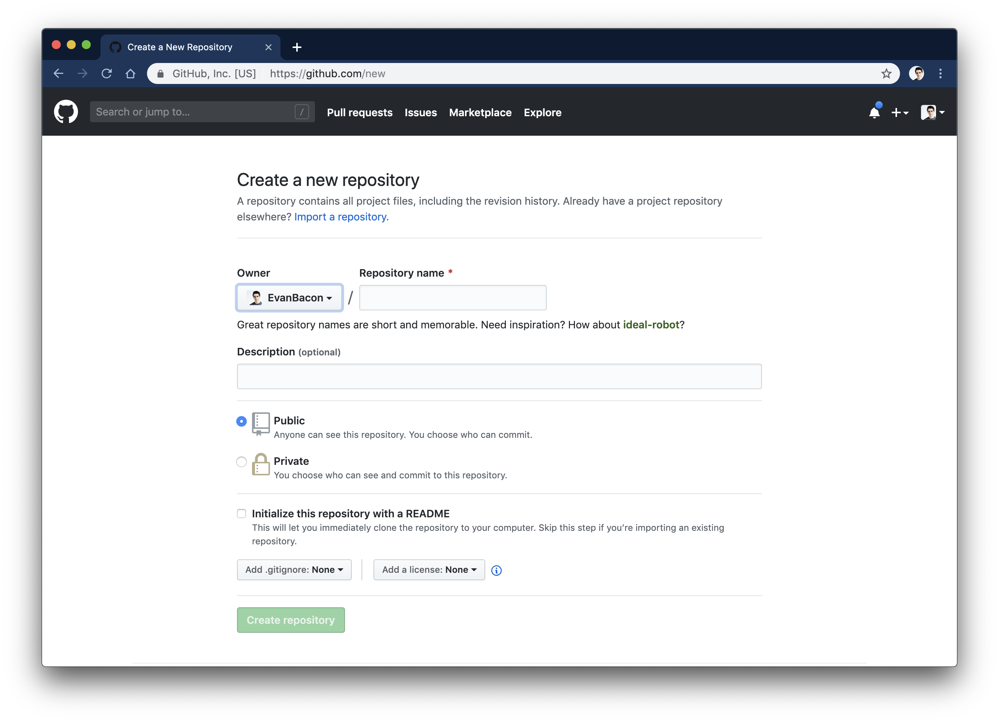
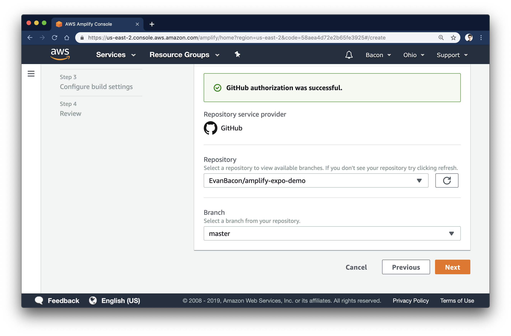
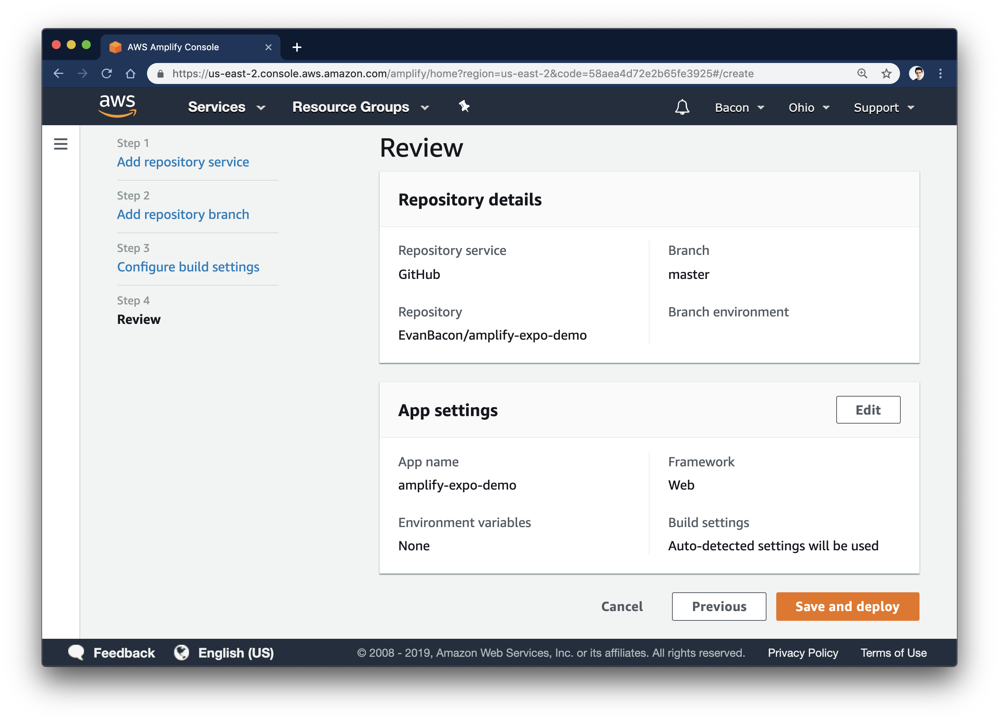
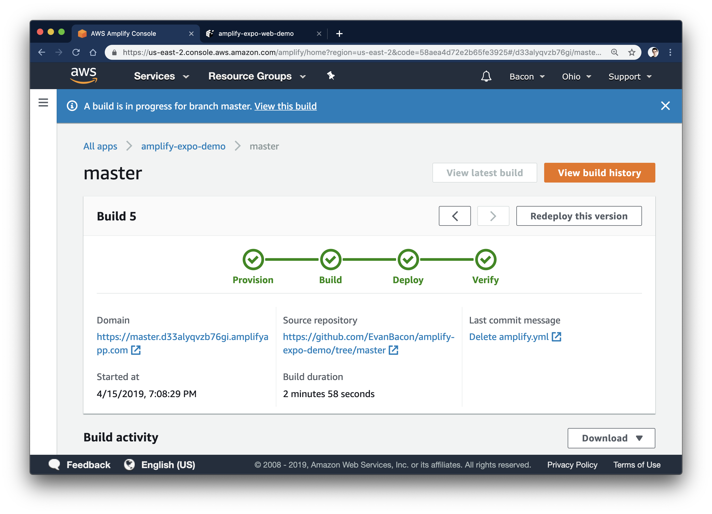
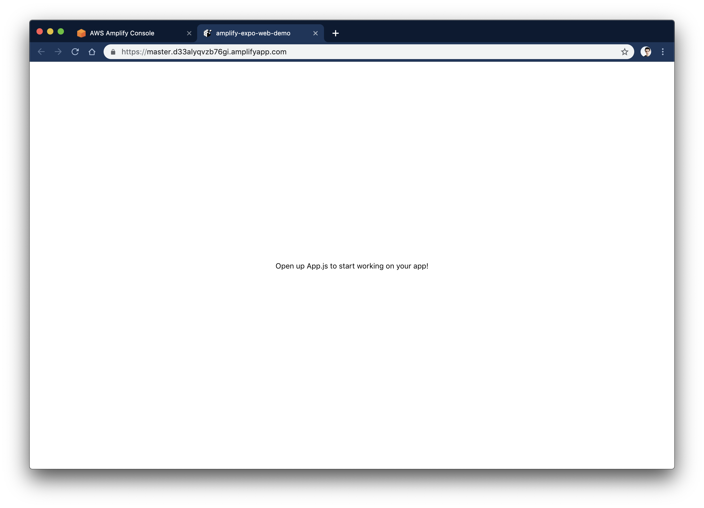

# Deploying Universal Apps with Amplify & Expo

##

Since we announced [Expo for web](https://blog.expo.io/expo-cli-and-sdk-web-support-beta-d0c588221375), lots of exciting new ideas have been flying around! One of my favorites is the combination of [Expo](https://www.youtube.com/watch?v=IQI9aUlouMI) and [Amplify](https://aws-amplify.github.io/docs/) to create full-stack universal applications. Thanks to [Nikhil Swaminathan](https://twitter.com/TheSwaminator) and [James Ide](https://twitter.com/JI), Amplify now automatically detects if your environment is using Expo, and will generate then serve a static website on AWS! Meaning you can get your Expo web app running immediately. 🔥

_Note: Expo for web is currently still in beta_.

## **Deploying to Amplify**

- Ensure you have the latest version of [Expo CLI](https://github.com/expo/expo-cli): `npm install -g expo-cli`.

- Open an existing Expo project, or create a new one with `expo init`.

- Run `expo start --web` to ensure everything is set up correctly. If Expo web is still in beta, you’ll probably be prompted to run `yarn add react-native-web react-dom` and add the `"web"` field to the `platforms` array in the `app.json`.

- After this, you can commit your changes to the branch you want to deploy from.

- Now create a git repo and link it on [Amplify’s web dashboard](http://aws.amazon.com/amplify). For this example (and everything else), I’ll be using Github.

 then link it to your [Amplify account.](http://aws.amazon.com/amplify)](./images/1sCY4LOHnLXhsHZausOrK1w.png)_[Create the repo,](https://github.com/new) then link it to your [Amplify account.](http://aws.amazon.com/amplify)_

After you’ve linked the repo, you can specify which branch you want to deploy from. Then, every time you commit to this branch, it’ll trigger a rebuild and Amplify will automatically republish your changes.

_I’m pretty edgy so I deploy from master, but maybe use a “production” branch 😅_

Just in case you hit a wall, this is what my project overview page looks like:

_Notice how AWS auto-detected Expo. 😁_

At this point Amplify will publish your first build by cloning the repo into a docker image. This could take a few minutes; if you scroll down on that page you can watch the progress.

_You can also move between builds and redeploy them._

## **Finally if you click on the “Domain” link you should see the following:**

_JKJK, this is life without zero-config auto deployment._

## **This is what you should actually see**

[Here is the live version](https://master.d33alyqvzb76gi.amplifyapp.com/)

_I didn’t add anything special to it btw. You can just publish right away._

That’s the basics of deploying your app with Amplify! Now you can start adding awesome services that work in both web and native —like [authentication with \*\*Cognito](https://github.com/dabit3/expo-user-authentication)**!
[**expo/amplify-demo\*\*
*Deploying an Expo web project to AWS Amplify. Contribute to expo/amplify-demo development by creating an account on…*github.com](https://github.com/expo/amplify-demo)

<!-- If you wanna see more there’s a great tutorial by [Nader Dabit](https://twitter.com/dabit3) here:
<YouTube ... /> -->
