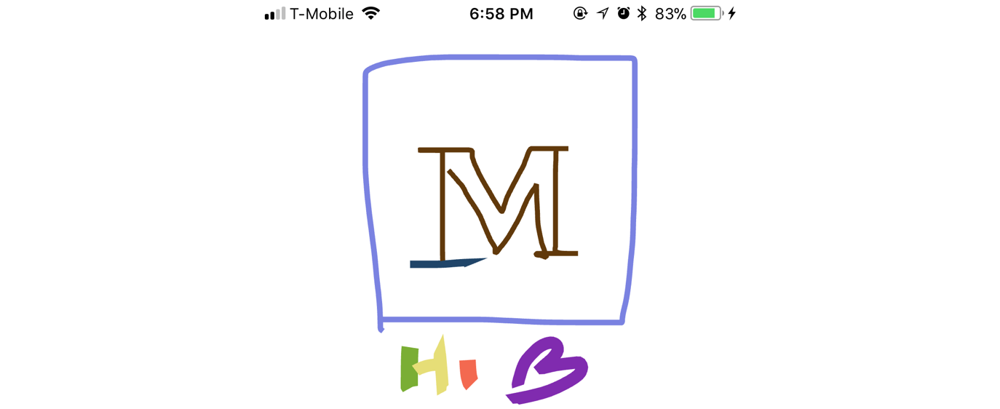

# Drawing & Signatures with Expo

## No tricky GL knowledge required (!)

TLDR: The library [**‘expo-pixi’](https://github.com/expo/expo-pixi) **provides a component, [**‘ExpoPixi.Sketch’](https://github.com/expo/expo-pixi/blob/943f82bb2ca8ed2e2fe62c5a2b854054fb475980/examples/filter-image/App.js#L125-L130),** that you can use to capture signatures, doodle, or annotate images!



Growing up in Austin, I spent a lot of time getting food from trucks in alleyways. These esteemed culinary organizations all used some kind of commerce application. This type of app is extremely simple to build with Expo.

All you need is a couple of buttons, a few pages of navigation, and then the last step is just to provide your signature. 😱 This was once pretty difficult to build in Expo…until now!! 😎 🔥 😎 💣

## Wait, but how?

Using [“expo-pixi”](https://github.com/expo/expo-pixi), you can add a component that lets you choose your brush’s color, thickness, and opacity. Then when your user lifts her finger, you get a callback. From there you can take a screenshot of the transparent view or get the raw point data if that’s what you’re looking for. 💙💙

## The Sketch Component

### Implementation

Under the hood, we create a [GLView](https://docs.expo.io/versions/latest/sdk/gl-view.html#content), build a PIXI renderer and stage, then add a PanResponder to the view. When your user drags his finger, we add points to an array, then draw a PIXI graphic to the screen. When the user lifts his finger again, we end the tracking of that line and notify the parent component that a new image is ready to be rendered! 🤩😮

### Also some added magic!

*Keeping it smoooooooth 😏*

We throttle the touches by 10ms, easing our line between the captured points. This creates a nice smooth line, out of an otherwise shaky hand. (Very important when people aren’t used to writing with a finger on a sticky tablet, while holding a falafel and wearing skinny jeans.)

### Component

The developer experience is then very simple: we give it a few props to define the stroke style.

```
const color = 0x0000ff;
const width = 5;
const alpha = 0.5;

<ExpoPixi.Sketch 
  strokeColor={color}
  strokeWidth={width}
  strokeAlpha={alpha}
/>
```


We can add a callback and take a screenshot:

```
const onChange = async ({ width, height }) => {
  const options = {
    format: 'png', /// PNG because the view has a clear background
    quality: 0.1, /// Low quality works because it's just a line
    result: 'file',
    height,
    width
  };
  /// Using 'Expo.takeSnapShotAsync', and our view 'this.sketch' we can get a uri of the image
  const uri = await Expo.takeSnapshotAsync(this.sketch, options);

};
...

<ExpoPixi.Sketch 
  ref={ref => this.sketch = ref}
  onChange={onChange}
/>
```


You can even access the raw line data, each line of which contains references to all its points.

```
const onChange = () => {
  for (let line of this.sketch.lines) {
    console.log(line.points)
  }
};
...

<ExpoPixi.Sketch 
  ref={ref => this.sketch = ref}
  onChange={onChange}
/>
```


### **Known limitations**

As of writing this, it’s not yet possible to make the edges or ends rounded, because PIXI hasn’t added support yet 🙃😱 (learn more on the [Pixi github issue](https://github.com/pixijs/pixi.js/issues/1637)).

## Finally

I hope I’ve made my city proud. This also gets us one step closer to having all the pieces needed to clone Snapchat 😈

### Links

If your last two keystrokes were ( ⌘ + ▼), then you and I probably have a lot in common. I’ve gotcha links right here! 👇 ⭐️ ❤️ 👏 👇
[**NPM: expo-pixi**
*Tools for using pixi in Expo*www.npmjs.com](https://www.npmjs.com/package/expo-pixi)
[**sketch on Expo**
*expo-pixi sketch example*expo.io](https://expo.io/@bacon/expo-pixi-sketch)
[**expo/expo-pixi**
*expo-pixi - Tools for using pixi.js in Expo*github.com](https://github.com/expo/expo-pixi/blob/master/examples/sketch/App.js)