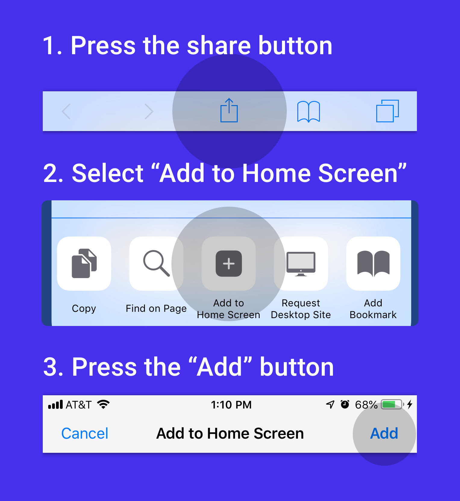

# Enabling iOS Splash Screens for Progressive Web Apps

## Everything you should know (2019)

_PWAs with splash screens won’t render a blank white card_

Earlier this year I started working on a process to run Expo apps in the browser as optimal progressive web apps. I quickly found that the information regarding iOS PWA splash screens is… sparse to say the least. So I’ve assembled all my findings into this article. 😁

**Note: **This is general web development information and does not depend on any prior React knowledge. There’ll be webpack-specific content at the bottom.

## What are iOS PWA Splash Screens?

To be clear, we’re only talking about the more primitive Safari for iOS and not Chrome for Android. Android splash screens [are very well documented](https://developers.google.com/web/tools/lighthouse/audits/custom-splash-screen) and have a clear system. As far as I know iOS PWA splash screens have only just become stable as of iOS 11.4.

_Steps to Adding a PWA on iOS_

The iOS PWA Splash Screen (actually referred to as the startup-image) is a set of images that you reference in your `&lt;head/&gt;` element. When the user presses “Add to Home Screen” the device caches these images locally which means they will load instantly and offline. When you go to the multi-tasker, your PWA will use a screenshot of the page you were just on. If you go home and wait ~5 seconds that screenshot will invalidate and the splash screen will be used to represent your app in the multi-tasker.

Very few apps implement this correctly, and others implemented the splash screen [exactly as documented](https://developer.apple.com/library/archive/documentation/AppleApplications/Reference/SafariWebContent/ConfiguringWebApplications/ConfiguringWebApplications.html) like Tinder, but still get the white screen. To actually get the expected behavior you’ll need to do a few more things that I’ve listed below.

_Very few PWAs support landscape, the last app has proper startup images._

## Why does it matter?

It may not seem like much, but if you do make a PWA then I would highly advise you to add a splash screen. Besides all of the great points listed in [Apple’s Human Interface Guidelines](https://developer.apple.com/design/human-interface-guidelines/ios/icons-and-images/launch-screen/), there are at least 2 other things:

- The PWA will appear to load faster.

- Create a preview that isn’t blank in the multi-tasker (personally I think this is the most important).

- Your app _feels_ native, even if it is just for a second.

- Assuming you’re [using Expo](https://blog.expo.io/expo-cli-and-sdk-web-support-beta-d0c588221375): Match your native app splash screen automatically.

- Finally, provide bragging material about how your PWA does something that most major websites don’t do.

## How to do it right… AFAICT

Maybe I’m missing something, I promise I read the whole paragraph in the [Apple documentation](https://developer.apple.com/library/archive/documentation/AppleApplications/Reference/SafariWebContent/ConfiguringWebApplications/ConfiguringWebApplications.html). I also consulted [Jackie Wung](https://medium.com/@jackiewung) who [worked on the Tinder PWA.](https://medium.com/@roderickhsiao/building-tinder-online-a447e6c0265e)

### Define a startup image for _every_ device size

If you set just one image (like in the apple docs) nothing will happen. You need an image for every device you plan on supporting, the dimensions must match the device resolution.

### Assign **media** attributes to every startup image meta tag

Once you have the images you’ll need to add a media attribute that defines _exactly_ what you’re trying to target. This means: width, height, scale (`-webkit-device-pixel-ratio`), and orientation.

**It’s really buggy! **You can define certain legacy sizes, and they’ll make the splash screen render at a clearly different height in the multi-tasker. In this case I’m using an iPhone 8 Plus with `1242x2148` instead of the correct `1242x2208` dimensions. So I guess if you really want to stand out, now’s your chance! 😄

<Tweet url="https://twitter.com/Baconbrix/status/1106094378978664448" />

### Orientation

Even though you can define an `orientation` field in your `manifest.json`, you cannot actually lock the iOS PWA orientation. This means that you need to account for landscape images as well. To do this, you’ll have to create new images for every device, and add `(orientation: portrait)` or `(orientation: landscape)` to your media attributes.

```
<link rel="apple-touch-startup-image"
media="screen and (device-width: 414px) and (device-height: 896px) and (-webkit-device-pixel-ratio: 2) and (orientation: landscape)"
href="/image.png" />
```

Of course adding landscape support will effectively **double** your image count, taking you from 10 to 20 startup images. Because the splash screen works offline I would hypothesize that it’s cached locally like the touch-icon. If this is true, then it should only ever be downloaded once and not have a continuous impact on the user’s data plan.

**Note: **Even devices that don’t use the home screen in landscape mode (like iPhone X) can still open in landscape mode, meaning a white screen will be rendered if it’s not added.

### Enabling PWA

Splash screens won’t work at all if you don’t include this meta tag which enables PWA behavior. It will also remove the URL bar, bottom tool bar, and navigation gestures from your PWA, so you’ll need to add custom navigation.

```
<meta name="apple-mobile-web-app-capable" content="yes">
```

You can also add the following [for parity in chrome](https://bugzilla.mozilla.org/show_bug.cgi?id=1114631):`&lt;meta name="mobile-web-app-capable" content="yes"&gt;`

### Testing

I couldn’t find anything that wasn’t convoluted. The process involved having to serve the app, open the URL in a new Safari incognito tab, create a PWA (bookmark), go to the home screen and open said PWA. If it didn’t work I needed to delete the PWA, clear the multi-tasker, make a new incognito window, and try again. 🙃

## Finally

[Here is a snippet](https://gist.github.com/EvanBacon/7fd4dc3be3d00096579bb0b134c56ec7) that shows proper splash screen setup in iOS. I have an example of this in practice here: [\*\*Basic Splash Screens Example.](https://5cb6d3a94c1b367b05843b5f--crossyroad.netlify.com)\*\*

<Gist url="https://gist.github.com/EvanBacon/7fd4dc3be3d00096579bb0b134c56ec7.js" />

Given how much code is involved I highly recommend using some form of generator. A really straightforward one you can use right now is [provided by Appscope](https://appsco.pe/developer/splash-screens) but as of writing this (April 2019) it doesn’t have landscape support.

## Webpack users

As I said at the beginning I stumbled upon this problem while working on Expo for web, which uses [React Native for web](https://github.com/necolas/react-native-web) to create universal applications. You get full splash screen generation with [the Expo CLI](https://github.com/expo/expo-cli). The actual generation is in a [Webpack plugin](https://github.com/expo/expo-cli/tree/master/packages/webpack-pwa-manifest-plugin) so if you wanted to, you could use it in any Webpack project, the NPM lib is `@expo/webpack-pwa-manifest-plugin`. If this interests you, and you have trouble setting it up feel free to [open an issue](https://github.com/expo/expo-cli/issues/new) or comment below!
[**Evan Bacon 🥓 (@Baconbrix) | Twitter**
*The latest Tweets from Evan Bacon 🥓 (@Baconbrix). @Expo for Web, Bluetooth, AR, Gaming, and videos 🥓 Lego Master…*twitter.com](https://twitter.com/baconbrix)
[**expo/expo**
*The Expo platform for making cross-platform mobile apps - expo/expo*github.com](https://github.com/expo/expo)
[**Follow me on Github :D**
*Bad at programming. Working on Expo and React Native (for web) PWAs. Follow me on Twitter for updates 💙🥓 - EvanBacon*github.com](https://github.com/evanbacon/)

### Special thanks to

[Nicolas Gallagher](https://twitter.com/necolas) and [Jackie Wung](https://medium.com/@jackiewung) for pointing me in the right direction. If you like progressive web apps, I highly recommend following them.
