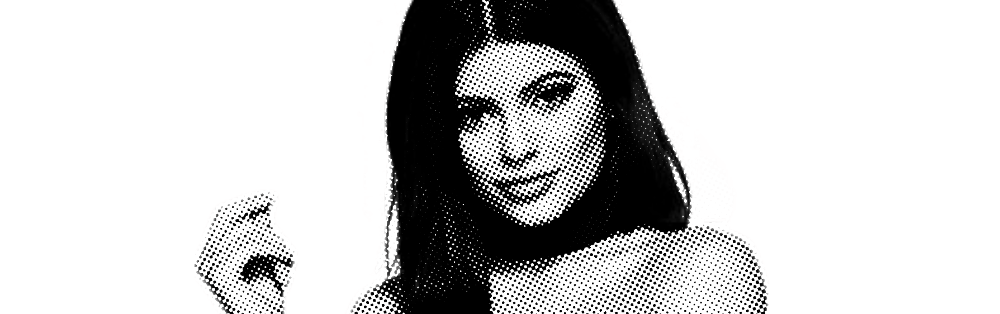

# Filtering Images with Expo

## Without any OpenGL knowledge required(!)

TLDR: Using the module [**‘expo-pixi’](https://github.com/expo/expo-pixi)**, you can filter images really easily! [**‘ExpoPixi.FilterImage’](https://github.com/expo/expo-pixi/blob/943f82bb2ca8ed2e2fe62c5a2b854054fb475980/examples/filter-image/App.js#L125-L130)** is a drop-in replacement for the ***`Image`*** component.

*Queen Kylie*

React Native and Expo are pretty great — nowadays, my whole life revolves around them! Unfortunately, there are still some apps that are really hard to build with it. Right now the list includes Snapchat and Instagram.

Being 20 and single, I prioritize Snapchat over eating, and sleeping. So this definitely needed to be possible with Expo, and fast!

### **But this is really easy to do in web code…**

Correct! So why not React Native? Because there is no canvas component! Luckily Expo has a pretty incredible substitute: **EXGL!**

EXGL is a Native Module that bridges WebGL into Native OpenGL for Embedded Systems (OpenGL ES). Created by the incredibly talented [Nikhilesh Sigatapu](https://medium.com/@s.nikhilesh), EXGL lets us use all sorts of WebGL libraries in Expo!

For this component we will be using a fantastic 2D library called Pixi[.js](http://www.pixijs.com/) and a helper library called [expo-pixi](https://github.com/expo/expo-pixi/)!

## The Filtered Image Component

### **Implementation**

Basically, we’ll be using a ‘Expo.GLView’ to create a ‘WebGLRenderingContext’. We then initialize a ‘PIXI.Application’ and pass it this context, and force it to use WebGL instead of Canvas. From there, we create a ‘PIXI.Texture’ from an ‘Expo.Asset’ using ‘expo-asset-utils’ and assigning this texture to a ‘PIXI.Sprite’.

Finally, we’ll center our sprite in our component, resizing it according to a ‘resizeMode’ prop, and apply some Pixi.js filters to the sprite!

### Component

Because all of the aforementioned actions are very common, we’re able to bundle everything in one component, and match the shape of the native Image component. By doing this we can avoid having to use GL all together!

```
<ExpoPixi.FilterImage
  source={require('./personal/kylie_jenner_099.png')}
  resizeMode="cover"
  filters={new PIXI.filters.DotFilter(0.5)}
/>
```


And just like that we have the article’s showcase image! We can also stack multiple shaders on top of each other!

```
const filters = [
  new PIXI.filters.BlurFilter(), 
  new PIXI.filters.NoiseFilter()
];

...

<ExpoPixi.FilterImage
  source={require('./personal/kylie_jenner_099.png')}
  resizeMode="cover"
  filters={filters}
/>
```


You can even use this to create image editing effects like adjusting brightness, contrast, saturation, etc.

```
const filter = new PIXI.filters.ColorMatrixFilter()
filter.brightness(0.5);
```


## Finally

As you can see, the options are pretty unlimited and nothing’s holding you back from creating a full-featured image editor with Expo!

### Links

For all my kindred spirits who scrolled to the very bottom of the article, I’ve got what you were looking for! 😎 ⭐️ ❤️ 👏 😄
[**NPM: expo-pixi**
*Tools for using pixi in Expo*www.npmjs.com](https://www.npmjs.com/package/expo-pixi)
[**Live demo on Expo**
*expo-pixi filter image example*expo.io](https://expo.io/@bacon/expo-pixi-filter-image)
[**Example component!**
*expo-pixi - Tools for using pixi.js in Expo*github.com](https://github.com/expo/expo-pixi/blob/master/examples/filter-image/App.js)