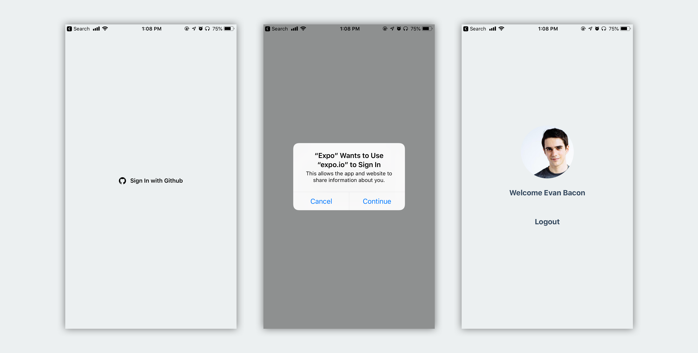
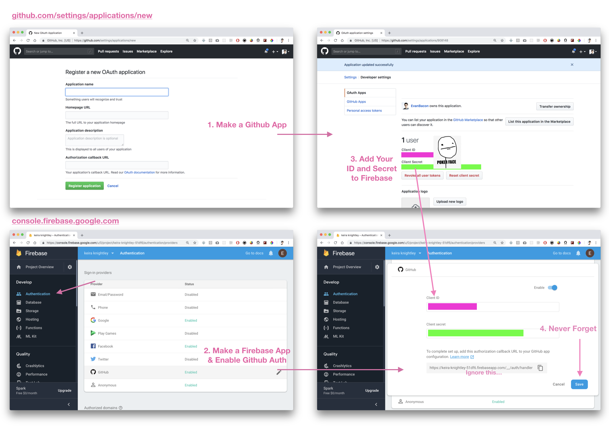
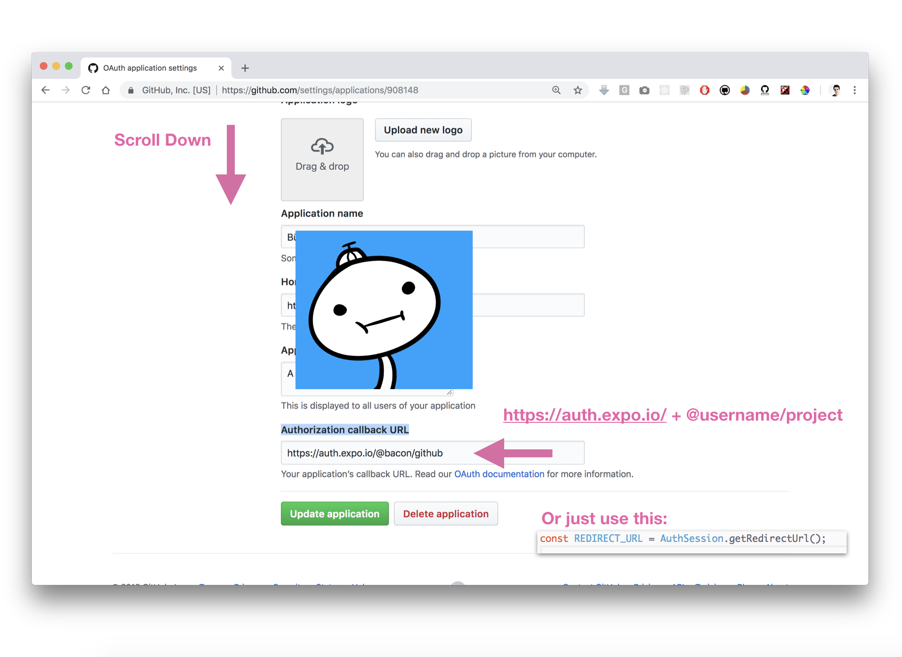

# Firebase & Github Authentication with React Native

import { Embed } from "../../../components/embeds";

## TL;DR https://snack.expo.io/@bacon/github

_What we'll be building_

Today we'll be looking at how to setup and use Github Authentication in your Expo app! We'll also be using that Github Auth to create a Firebase user.

This is a hard thing to search because the “Github” part usually returns any “firebase auth” on `github.com`. But hopefully this is what you were looking for. 😅

<Embed url="https://snack.expo.io/embedded/@bacon/github" />

### The Process

- Create a Github app: [\*https://github.com/settings/applications/new](https://github.com/settings/applications/new)\*

- Create a Firebase app: [https://console.firebase.google.com/u/0/](https://console.firebase.google.com/u/0/)

- Enable Github Auth & add the Github client ID and secret

- Make a new Snack: [https://snack.expo.io](https://snack.expo.io)

- Use Expo.AuthSession to get a user token

- Create a Firebase user with the token

## And now with pictures:

_Sorry for mobile users 😅😓_

Now we just need to add the URL callback. This can be achieved by using the following formula: `[https://auth.expo.io/](https://auth.expo.io/) + @yourExpoUsername + yourProjectName` or just get the result of `Expo.AuthSession.getRedirectUrl()` which will return the same thing. If you use the wrong URL you will be given an Error: `*redirect_uri_mismatch` \*you can change the URL at any time.



## Time to code stuff

This code is basically just drag and drop, it'll work under most conditions and it's easy to edit. But I'll explain some of the more confusing parts here.

_Another one of my signature “quick” tutorials… 🙃_

The only key thing you should know about is `Expo.AuthSession` [https://docs.expo.io/versions/latest/sdk/auth-session](https://docs.expo.io/versions/latest/sdk/auth-session)

AuthSession manages all the weirdness around web authentication flows in a native app. This means you don't have to do any awkward or unreliable things like adding a listener to ReactNative.Linking. You can use AuthSession for things like Github, Twitter, Instagram, ect…

To get started, import AuthSession, and define the auth related constants.

```js
import { AuthSession } from "expo";

const REDIRECT_URL = AuthSession.getRedirectUrl();

const github = {
  id: "xxxxxxxxxxxxxxxxxxxx",
  secret: "xxxxxxxxxhixxxxxxxxxxxxxxxxxxxxxxxxxxxxx",
};

const githubFields = ["user", "public_repo"];
```

Now we want to start an auth session and retrieve a token from it

```js
// 1
const { params } = await AuthSession.startAsync({
  authUrl: authUrlWithId(github.id, githubFields),
});

// 2
function authUrlWithId(id, fields) {
  return (
    `https://github.com/login/oauth/authorize` +
    `?client_id=${id}` +
    `&redirect_uri=${encodeURIComponent(REDIRECT_URL)}` +
    // 3
    `&scope=${encodeURIComponent(fields.join(" "))}`
  );
}
```

1. Start an AuthSession and pass it a `authUrl` that we will create with our Github client ID. This will return special code that we can use later for creating an “access token”.

1. Compose a auth URL with our ID and the fields (or scope) we wish to get access to. Fields work like permissions in the Facebook API.

1. We will take a list of fields and encode them into a web friendly URL. Learn more about the different kinds of scopes here: [https://developer.github.com/apps/building-oauth-apps/understanding-scopes-for-oauth-apps](https://developer.github.com/apps/building-oauth-apps/understanding-scopes-for-oauth-apps/)

We are going to skip over some error handling for the sake of brevity, but you can see in the example how to handle user cancellation or invalid redirect URI.

```js
// 1
const { access_token } = await createTokenWithCode(params.code);

async function createTokenWithCode(code) {
  // 2
  const url =
    `https://github.com/login/oauth/access_token` +
    `?client_id=${github.id}` +
    `&client_secret=${github.secret}` +
    `&code=${code}`;
  // 3
  const res = await fetch(url, {
    method: "POST",
    headers: {
      Accept: "application/json",
      "Content-Type": "application/json",
    },
  });
  return res.json();
}
```

1. The last part of the Auth Session is creating an “access token” from the returned code. We can then use this token to create a Firebase user.

1. Create another custom URL but this time we will pass it “code” along with our Github ID and secret.

1. Now we will post our code to the Github API and request that it returns data in the form of a JSON object which we can easily parse in JavaScript.

Now to create a user, all we need to do is simply pass the token to Firebase with a Github provider.

```js
const credential = firebase.auth.GithubAuthProvider.credential(token);

const user = await firebase
  .auth()
  .signInAndRetrieveDataWithCredential(credential);
```

And just like that you have created a user! You can now access that user's Github name and photo like so:

```js
const { displayName, photoURL } = firebase.auth().currentUser;
```

We can also link our Github account to an existing Firebase user.

```js
const credential = firebase.auth.GithubAuthProvider.credential(token);

firebase.auth().currentUser.linkAndRetrieveDataWithCredential(credential);
```

This is cool because now the user has the ability to sign in with their Github and access all the same data!

## Restoring User Authentication

In the example project you can see that we use `AsyncStorage` to save our access token locally, if for some reason we open the app and are not signed in, the system will automatically try and login with the stored credential.

```js
await AsyncStorage.setItem(GithubStorageKey, token);

... Later ...

const token = await AsyncStorage.getItem(GithubStorageKey);
```

Remember to clear your local token when the user chooses to sign-out. This will prevent the code from automatically logging the user back in.

```js
await AsyncStorage.removeItem(GithubStorageKey);

await firebase.auth().signOut();
```

## Security

If you want to keep your Github client info secure, you will need to perform these calls in a server. This can be easily achieved using the exact same code in a firebase cloud function.

## That's it! 👏

I hope you enjoyed this tutorial that no one asked for, I was able to just drop this Auth method into one of my apps and I'm pretty pleased with how well it works. If someone wants to figure out instagram and twitter for me that'd be lit 🔥🔥🔥

_Tackling obstacles together ❤_

<Embed url="https://twitter.com/baconbrix" />

[**EvanBacon (Evan Bacon)**
*Bad at programming. Native Dev, from Austin. I make tutorials and open source for funsies. 💙 Professionally I get to…*github.com](https://github.com/evanbacon)
[**AuthSession - Expo Documentation**
*Guides App Icons Assets Error Handling Preloading & Caching Assets Icons Using Custom Fonts Routing & Navigation…*docs.expo.io](https://docs.expo.io/versions/latest/sdk/auth-session)
