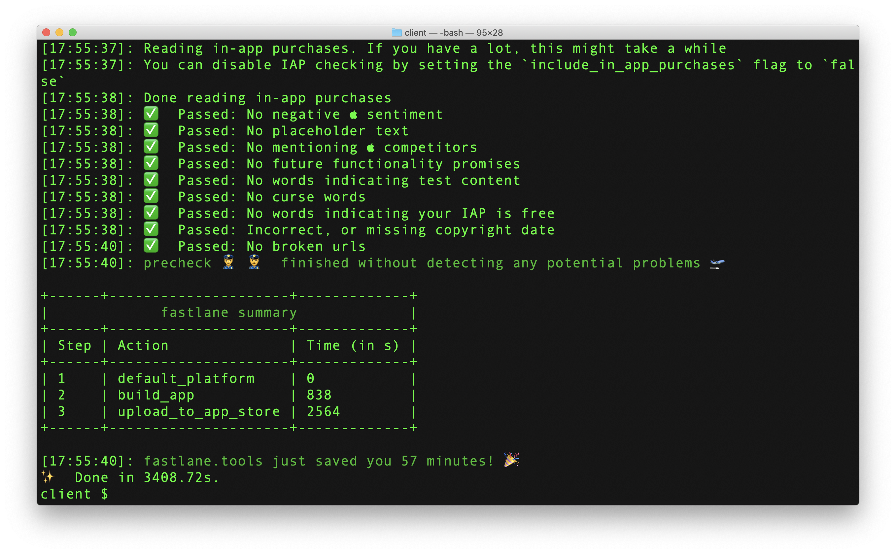
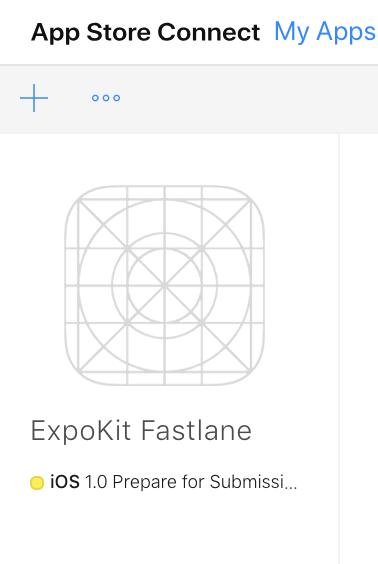
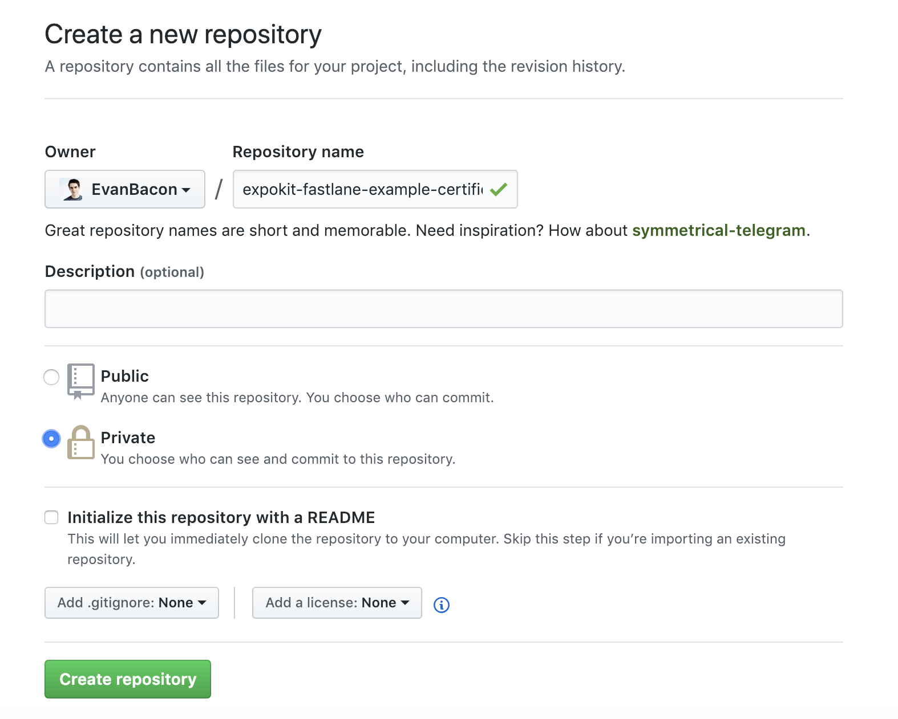
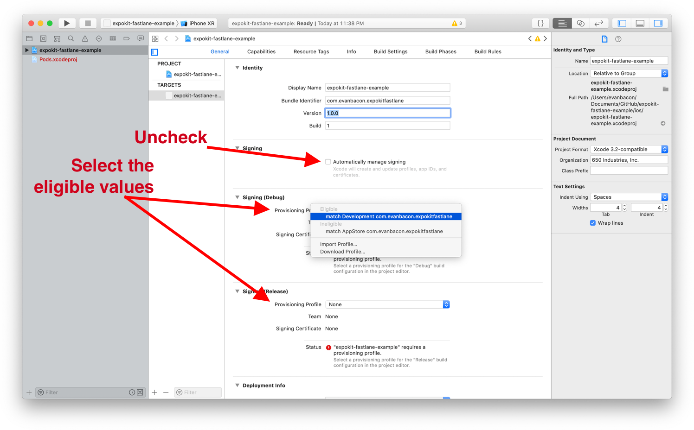

# How to Publish ExpoKit Apps on the App Store

## The easiest way I know how 😎

> ExpoKit is now deprecated — Simply use [EAS Build](https://docs.expo.dev/build/introduction/) to send apps with custom native code to the App Store!

_The most beautiful thing I’ve ever laid my eyes on_

If you’re like me, you probably enjoy the luxurious `expo build:ios` command, but if you upgrade/eject to add custom native modules, then you need to take a different approach.

Here is my favorite way to upload ExpoKit apps to the App Store on iOS. By the end, you’ll be able publish with just one line in the terminal — like in Expo 😍

The steps where I discuss using `produce` & `deliver` actually apply to regular Expo projects as well. [I usually use both with any project I upload to the App Store.](https://blog.expo.io/manage-app-store-metadata-in-expo-with-fastlane-deliver-1c00e06b73bf)

## Starting from the beginning

Because this is such a messy process I’ll try and document every keystroke so we can better identify where something goes wrong. **Most importantly this will not work without a paid Apple Developer account ☹️**

### Create an Expo project

We will start with an Expo project but when we “Eject” we are actually just turning the project into a React Native project with a bunch of modules installed. So feel free to use these steps with any RN project. If you don’t have the `expo` command then run `npm i -g expo-cli` to get it.

```sh
$ expo init

> ? Choose a project name: expokit-fastlane-example
> ? Choose a template: expo-template-blank
> ? Yarn v1.12.3 found. Use Yarn to install dependencies? Yes
```

Then enter the project folder…

```sh
$ cd expokit-fastlane-example/
```

Commit your changes! We will be changing a lot of stuff through the CLI. It’s pretty important to commit throughout this process just in case you hit some unexpected error. I find it’s best to start a command over again when this happens. 😁If you ever want to undo a local commit run: `git reset HEAD~1 --soft`

```sh
expokit-fastlane-example $ git add .; git commit -m “init”
```

[Eject to ExpoKit](https://docs.expo.io/versions/latest/expokit/eject) — If you have a mac and this tutorial then you have nothing to be afraid of! Like I said earlier we are just converting this project to a vanilla React Native project. [Brent Vatne](https://twitter.com/notbrent) is also [currently working to make this entire system easier as well.](https://blog.expo.io/expokit-2019-1e5cb02106f8)

**Picking a Bundle ID: **I think it’s very convenient to have the android package be the same as the bundle ID. The valid schemes are a little different so try to **avoid using hyphens in the bundle ID **because this won’t work on Android.

```sh
expokit-fastlane-example $ expo eject

? How would you like to eject from create-react-native-app?

> ExpoKit: I’ll create or log in with an Expo account to use React Native and the Expo SDK.

? What would you like your iOS bundle identifier to be?

> com.evanbacon.expokitfastlane

? What would you like your Android package name to be?

> com.evanbacon.expokitfastlane
```

😊Commit your work, ejecting adds a lot of code, also you might want to roll it back for various reasons.

```sh
expokit-fastlane-example $ git add .; git commit -m “ejected”
```

Enter the iOS folder, we will be primarily working in this folder.

```sh
expokit-fastlane-example $ cd ios
```

### Initializing Fastlane

Here is where the tutorial really starts. If you don’t know what Fastlane is then I recommend you take a quick glance at [their website](https://fastlane.tools/).

```sh
ios $ fastlane init

? What would you like to use fastlane for?

1. 📸 Automate screenshots
2. 👩‍✈️ Automate beta distribution to TestFlight
3. 🚀 Automate App Store distribution
4. 🛠 Manual setup — manually setup your project to automate your tasks

> 3
```

You may be prompted to sign-in with your Apple ID. But usually this is stored in the keychain and you won’t get a prompt.

```sh
? Apple ID Username:

> evanjbacon@gmail.com
```

I got an annoying error right after the prompt. `It looks like the app ‘com.bacon.expokitfastlane’ isn’t available on the Apple Developer Portal for the team ID ‘QQ57RJ5UTD’ on Apple ID ‘[evanjbacon@gmail.com](mailto:evanjbacon@gmail.com)’`

I tried changing the Bundle ID (a good reason to commit before ejecting) then but the error was still there. I figure this is just a bug with Fastlane, so just pass `n` in the next bit and we will run one more command to register the bundle ID.

```sh
? Do you want fastlane to create the App ID for you on the Apple Developer Portal? (y/n):

> n
```

If everything worked out OK, then you should see this bad boy!

```sh
$ [22:49:14]: — — ✅ Successfully generated fastlane configuration — -
```

At this point Fastlane will explain a bunch of things that you _could_ read. If you’ve ever played an RPG then you probably took the same approach that I did… mashing enter a bunch of times until the prompts went away ;]

😏Commit your fastfile

```sh
expokit-fastlane-example $ git add .; git commit -m “fastlane init”
```

### Create the App Entry

At this point, you should have a new folder `ios/fastlane/` with a `Fastfile` & `Appfile`. To be plus-ultra we want to also generate a `Deliverfile` & `Matchfile` too. The `Deliverfile` isn’t actually required, at the very end (next to the clap button) I explain why.

If you hit the bundle ID bug that I did then you need to create an app in Appstore Connect (formerly iTunes Connect). This is very easy, or at least it should be. We will use `fastlane produce` which exists for the sole purpose of avoiding that god-forsaken website.

```sh
ios $ fastlane produce init
```

You may need to sign-in to your iTunes developer account, though sometimes it’ll just auto authenticate. Afterwards you’ll want to set the name of your app (how it’ll appear in the App Store)

```sh
? App Name:

> ExpoKit Fastlane
```

Congrats, now you’ve `Successfully created new app ‘ExpoKit Fastlane’ on App Store Connect with ID`!

You won’t see any git changes but if you go to [AppStore Connect](https://appstoreconnect.apple.com/) you should see a new app created and ready for you! I know I said `produce` is used for avoiding App Store Connect but I get this strange satisfaction from going to App Store Connect and looking at the new app entry, then thinking “hah I didn’t need you after all”.

_Comment the name of your produced app below so I can cackle with you._

### Set up Metadata with Deliver

- [Maximize deliver usage in Expo](https://blog.expo.io/manage-app-store-metadata-in-expo-with-fastlane-deliver-1c00e06b73bf) (actually not too bad)

- [Here are the official docs](https://docs.fastlane.tools/actions/deliver/#deliver)

Deliver is used for syncing your app store metadata with your git repo. This is very convenient for app versioning. You can use `deliver` in either vanilla Expo or ExpoKit (or even React Native init)!

```sh
ios $ fastlane deliver init
```

Note that I’m running all of these commands in `ios/` If you don’t then you will need to specify the bundle ID for your target app. But having the fastlane metadata in the same place is pretty important IMO

😒If you’re tired of the reminders then—idk — Commit the metadata.

```sh
expokit-fastlane-example $ git add .; git commit -m “fastlane deliver init”
```

### Pushing metadata to the App Store

At this point you can type `fastlane deliver` and it will push all of the blank metadata to the App Store entry you created with `produce`

### Code Sign with Match

- [Here are the official docs](https://docs.fastlane.tools/actions/match/#setup)

Now we need to do our code signing. If you know any iOS developer, you’ve probably seen the sadness looming deep in their solemn gaze. This is because of iOS code signing, code signing is —* I go on to curse a lot but the editors had me remove it (understandably) — *less than pleasing to use.

But we can skip the entire process with a couple of lines! 😮

```sh
fastlane match init
```

This will ask you for the URL to a **private** repo. (I think you can get a free one on gitlab.) If you have a paid Github account then you can make as many as you want. (💪Don’t wanna flex too hard but I… don’t like to pay for stuff)

_Notice the name, private access, and the lack of a README_

Name the repo something like `project-certificates` or whatever you want.

If your computer is setup with SSH then you should use the `git` URL, otherwise the `https` one is aight too.

```sh
? URL of the Git Repo:

> git@github.com:EvanBacon/expokit-fastlane-example-certificates.git
```

Now you should have a `ios/Matchfile`

Now you need to enter XCode for a brief moment. Open the white project `ios/<project>.xcworkspace` Then on the general tab, make sure your “Automatically manage signing†option is **UNCHECKED** and after we run the next two commands, you’ll want to select the “eligible†profiles.

If you’ve already messed with your signing then check out this neat command [\*\*MATCH NUKE](https://docs.fastlane.tools/actions/match/#nuke) 🤯\*\*

_Here is a diagram ❤_

Like I said above, you need to generate the certs before you can select them like I misleadingly show in the picture above. You need two types of certificates, **appstore** (production) and **development**. So run the next two commands:

```sh
fastlane match appstore

? Passphrase for Git Repo:

> writingTutorialsOnFridayNightIsCool

# [23:45:45]: All required keys, certificates and provisioning profiles are installed 🙌
```

generate a development certificate with the following command. You probably won’t get prompted to add a password again.

```sh
fastlane match development

# [23:46:48]: All required keys, certificates and provisioning profiles are installed 🙌
```

**_From the docs:_**

> This will create a new certificate and provisioning profile (if required) and store them in your Git repo. If you previously ran match it will automatically install the existing profiles from the Git repo.
> The provisioning profiles are installed in ~/Library/MobileDevice/Provisioning Profiles while the certificates and private keys are installed in your Keychain.

### Install Pods

You can prolly skip this (…entire tutorial)

In `ios/` run `pod install` to download all of the dependencies.

### Should I Commit the Pods?

_TL;DR_: [Cocoapods offically say “commit ur 💩 computer boi”](https://guides.cocoapods.org/using/using-cocoapods#should-i-check-the-pods-directory-into-source-control)

After you install your libs you may notice a lot of extra files in your git repo. Cocoapods have a `ios/Podfile.lock` that is generated after running `pod install`, this file should always be committed. You can use this file to regenerate your `ios/Pods/` folder.
React Native pods are usually always _”development pods”_ which means they are local. Specifically they are stored in the `node_modules` folders. Because of this, there is a lot of ambiguity over whether or not you should commit the `ios/Pods/`.

I don’t save the pods, I have **commit**-ment issues! 🤓🤪😂 it’s actually a pretty serious personal issue :[

### Publish to the App Store!!

Finally we’re done! First make sure that you have the expo server running with `expo start` in the root directory, then in `ios/` run `fastlane release` to generate the `.ipa` file and push it to the App Store! 😁

### Update the Metadata

You can also run `fastlane deliver` to push all of your local metadata (including the binary and screenshots). I usually set the categories in the App Store Connect website then run `fastlane deliver download_metadata` which downloads the metadata into the local copy. You can push up the data faster with `fastlane deliver --skip_binary_upload --skip_screenshots` also `--force` to skip the HTML preview.

### OTA Updates

Use `expo publish` to upload your JS changes whenever you want. If you change native code, or update the Expo version, or use a different release channel — the changes may not (won’t) show up. The CLI should warn you about this.

### Final Commit 😶

```sh
expokit-fastlane-example $ git add .; git commit -m “fastlane deliver init”
```

## Extra Credit

Here are a couple of other things I do to make life easier.

### [Set up notifications](https://www.youtube.com/watch?v=61u3vZFerb0)

If you’ve ejected to ExpoKit then the Expo Notifications won’t work anymore. As an alternative use this library: [https://www.npmjs.com/package/expo-firebase-messaging](https://www.npmjs.com/package/expo-firebase-messaging). The instructions are something like `fastlane pem` then upload the files to firebase. [I have an angry video tutorial walking through the process](https://www.youtube.com/watch?v=61u3vZFerb0)

### Add a Deliverfile

Create a file `ios/Deliverfile` I usually just do the following. The last line is really the only extra functionality, everything else is added convenience (which is pretty important if you’re lazy and sloppy like me)

```rb
app_identifier “com.bacon.expokitfastlane” # The bundle identifier of your app

username “evanjbacon@gmail.com” # your Apple ID user

copyright “#{Time.now.year} Evan Bacon”
```

I usually have a git submodule for `ios/fastlane/metadata/trade_representative_contact_information` because it’s my personal info and it never changes. I use a Google Dialer number to protect my actual number — which you could also just ask me for 😬

### Patch Functions

You can add version bumping functions to your `Fastfile` if you want. It’s a popular thing, I never use it though 😏

```rb
desc “Increment the app version patch”
 lane :bumpPatch do
 increment_version_number(
 bump_type: “patch”
 )
 end
desc “Increment the app version minor”
 lane :bumpMinor do
 increment_version_number(
 bump_type: “minor”
 )
 end
desc “Increment the app version major”
 lane :bumpMajor do
 increment_version_number(
 bump_type: “major”
 )
 end
```

## Hold that Clap Button

That’s it for now, hope this helps! Really I just wanted to put this all in one place cuz I use it for each of my ejected apps. I’ll probably put a video walk-through together as well so remember to subscribe for even more juicy content!

## [Here is the source code to the project I used above](https://github.com/EvanBacon/ExpoKit-Fastlane-Example)

[**Subscribe on Youtube**
*Expo is a free and open source toolchain built around React Native to help you build native iOS and Android projects…*www.youtube.com](https://www.youtube.com/c/exposition?sub_confirmation=1)

- 💬 Join us on [Discord](https://chat.expo.dev/) or the [forums](https://forums.expo.dev/) to discuss the release.

- ⭐️ Help us out by [starring Expo on GitHub](https://github.com/expo/expo), filing bug reports in [issues](https://github.com/expo/expo/issues), or opening [discussions](https://github.com/expo/expo/discussions) with questions or proposals.

- 🥓 Follow me on Twitter for more updates: [baconbrix](https://twitter.com/Baconbrix).
  [**EvanBacon — Overview**
  *You can’t perform that action at this time. You signed in with another tab or window. You signed out in another tab or…*github.com](https://github.com/evanbacon)
