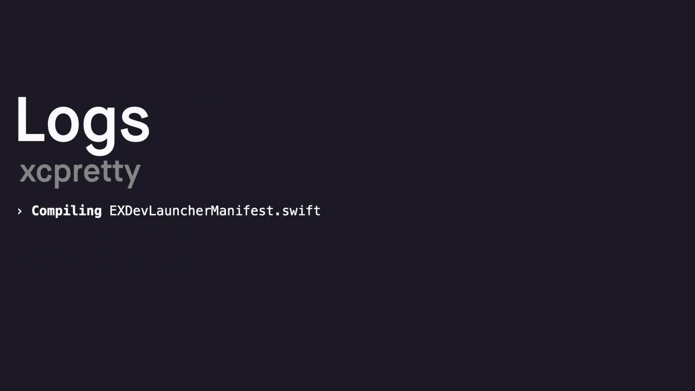
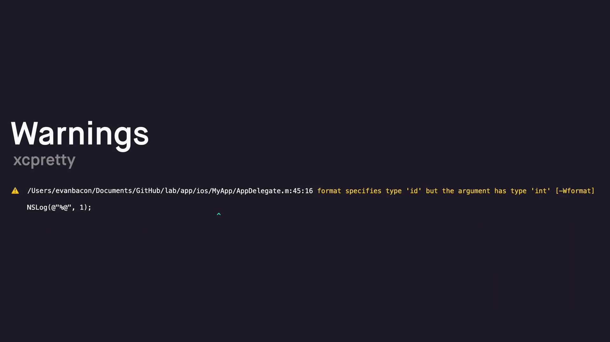
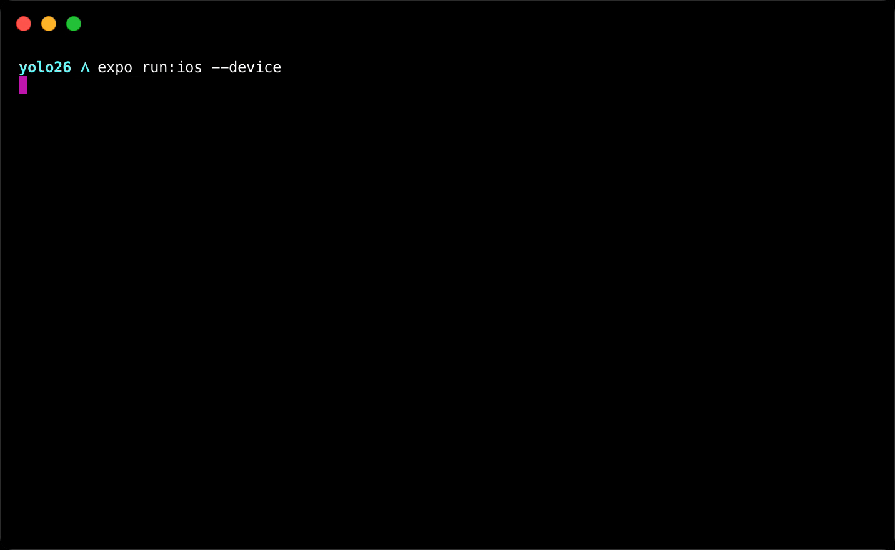

# Introducing&#58; Expo Run Commands

## Expo Go can get you from zero to “hello world” without ever needing to do a native build. This works great for many cases, but when it comes time for custom native code, then what do you do?

Historically, you’d “eject” from Expo, losing the ability to do tons of great things like [over-the-air updates](https://docs.expo.io/versions/latest/sdk/updates/), [easy push notifications](https://docs.expo.io/push-notifications/overview/), [cloud builds](https://docs.expo.io/build/introduction/), [simple app store submissions](https://docs.expo.io/submit/introduction/), and configuring your icons, app IDs or other metadata from the `app.json`.

Over the last year we’ve rolled out solutions to all of these issues, with services like [EAS build and submit](https://docs.expo.io/eas), [prebuilding](https://expo.fyi/prebuilding), expo-notifications and expo-updates, and running any React Native project in the Expo Go app. This enables developers to switch between having Expo manage an app’s native code (managed workflow) and managing the native code on their own (bare workflow) with ease.

Today we’re introducing the `expo run:[ios|android]` commands, the next step in closing the gap between the managed and bare workflow.

* Build and run your iOS app: `expo run:ios`

* Build and run your Android app: `expo run:android`

*Building a custom native app on iOS*

The first time you run these commands in an Expo app, they’ll generate all of the native code for your project by running `expo prebuild`. Prebuild is similar to `expo eject`, but there’s an important distinction — the wording clarifies that you’re not actually losing anything when you run the command, you’re just creating the Android and iOS native directories that are required for building the project.

After prebuild, the run commands will build the native binary, start a local dev server for interacting with Metro bundler, and install the app on your device or simulator.
> **⚠️ expo run:ios** and **expo run:android** are designed for Expo SDK 41+ projects. iOS Builds are macOS only, check out [EAS Build](https://docs.expo.io/build/introduction/) for cloud solutions.

## Use cases for run commands

* **Test and debug your standalone app locally**, without the [limitations of Expo Go](https://docs.expo.io/introduction/why-not-expo/#limitations-of-the-managed-workflow). You can easily revert the side effects of `expo run` (like the creation of the `ios` and `android` directories) when you’re done by checking out your most recent git commit and running `npm install`. You can also keep the native code around if you’d like — all Expo tools and services work in either context.

* **Add custom native code that isn’t available in Expo Go**. Sometimes you just need those one or two crucial features not available in Expo Go, the run commands make it easier than ever to customize the native code of your Expo project. You can still use Expo Go [if you follow some guidelines](https://docs.expo.io/bare/using-expo-client/), and [Expo Dev Client is coming soon](https://blog.expo.io/expo-managed-workflow-in-2021-d1c9b68aa10)! Note that once you add custom native code to your project you will no longer be able to use `expo build`, you will need to use [EAS Build](https://docs.expo.io/build/introduction/) or other platform build tools.

* **Develop prebuild config plugins for your React Native library or project**. Prebuild plugins are great because you can easily test them and ensure that your native code is always in a predictable state. When the time comes, you can utilize this to easily upgrade your project’s native code automatically.

* **A drop-in replacement for `npx react-native run-[ios|android]`**. Try the Expo CLI run commands out on any React Native project, we think you will like them!

## Highlighted features of `expo run:ios`

Native iOS builds are … difficult, and we’re extremely proud of the work we’ve done on `expo run:ios` to make them easier than ever before! We automate dependency configuration, dev code signing, logging, and profiling in a seamless manner.

## Clear and intuitive logging

The logs are custom formatted for native React projects, they’ll show you which native file maps to which Node module, providing much better context when something takes too long to compile.

By default, you’ll only see warnings that are relevant to your native project, i.e. no random formatting warnings for Node modules that you cannot fix.

Here’s a comparison of Expo to the most popular formatter `xcpretty` (used by most tools).

On top of that, errors and warnings are thoughtfully designed to help you quickly fix problems and get back to developing!

Expo’s log formatter doesn’t rely on global packages like `xcpretty` being installed, so the results are always consistent and reliable!

## Helpful warnings and errors

Native warnings and errors are optimized for Node developers and help you determine exactly what happened without needing to dig around in native code — just follow the arrow, which now points you to exactly where you need to look.

Warnings and errors are also formatted in a way that works better on shorter terminals, and matches errors in the Babel and Jest ecosystem, making them more familiar to web developers and more consistent across the React ecosystem!

## Native runtime errors directly in terminal logs

When a fatal error stops your app, you often need to open Xcode, rebuild the app, and reproduce the error to determine what went wrong. But `expo run:ios` catches these errors and surfaces them to you instantly in the terminal (this only works on iOS simulators):

So something as simple as a missing permission message will be obvious and easy to fix. This also enables you to catch other useful native warnings that you might not have seen otherwise, often third-party packages will log info about memory issues or misconfiguration.

## Development Code Signing

If you want to see how your app will run on your device, all you have to do is connect it and run `expo run:ios —-device` and select your connected device!

Expo CLI will automatically sign the device for development, install the app, and open it! Here’s a demo of signing with multiple developer profiles installed on your computer:

*The first option is bold because it was used it in my previous projects.*

Users with a single profile will skip the prompt and go right to building. All subsequent runs will read your preference from the Xcode project so you can easily switch between Xcode and Expo CLI!

`expo run:ios`uses delta installs and other optimizations to make rebuilding your app on a connected device faster than ever before.

## Plays nicely with Device Lock

If you forgot to unlock your device (or it just auto locked because Xcode builds take so long), Expo CLI will prompt you to unlock it and try installation again.

*Notice that we automatically copy less files on subsequent installs.*

## Highlighted features of `expo run:android`

In general, Android apps are just easier to build and install, but `expo run:android` still includes a few clever optimizations.

*Building a custom native app on Android*

## Fast rebuilds and build profiling

Rebuilding your Android app with Expo CLI is fast, and you don’t have to take our word for it, we added the ability to profile Android builds using the environment variable `EXPO_PROFILE=true`. This will generate a Gradle report of how long everything took to build, along with info regarding the wrapper command:

We also have many convenience features like package name and bundle identifier prompts which will attempt to validate availability based on existing apps published to the App Store and Google Play Store.

## Expo Run Commands and Expo Dev Client

As of May 2021, `expo-dev-client` public beta is coming very soon! But it would be incomplete for us to talk about the run commands without mentioning the dev client.

The run commands integrate with dev client to provide an experience that is very similar to Expo Go: when you run a debug build of a project with dev client installed, Expo CLI will launch directly into the project within the client, and it will also make it available under the “Recently in development” section of the app for easy access from other devices already running the client. Expo CLI also displays a QR code that can be scanned to launch into the project.

A great feature of Expo Go (and all web browsers) is the ability to run multiple projects at once using different ports. This is difficult in React Native because server information is [hard coded into the native app](https://github.com/facebook/react-native/blob/d1ab03235cb4b93304150878d2b9057ab45bba77/React/Base/RCTDefines.h#L87). But using the new `expo-dev-client` package with Expo run commands, you can use any port to run your project, not just 8081! If 8081 is busy, you’ll be prompted to use another port.

*Every React Native developer has been confused by an error caused by their app using the bundler for another project that they previously ran on their machine and forgot to close. Expo CLI will let you know if the port is busy and if it’s because a bundler is already running for the same project, or a different project in another window.*

## Future plans

In the future, we plan to add prebuild config plugin support to more popular third-party packages. Community packages like `react-native-nfc-manager` already support prebuild today! Many packages like `react-native-fast-image`, `@react-native-menu/menu`, `react-native-date-picker`, `react-native-blurhash`, etc. work out-of-the-box with Expo prebuilding, no config plugin required.

We have PRs open to add prebuild support to `react-native-ble-plx` (bluetooth), `react-native-health` (HealthKit), `react-native-webrtc` (video streaming), and `@react-native-voice/voice` (speech recognition). With more in the works. Many of these initial packages were chosen based on user votes from [Expo canny](https://expo.canny.io/feature-requests).

We also plan to reduce the side-effects of running `expo prebuild` to just the `ios` and `android` folders. This will help to make the state of custom Expo apps more predictable.

## Why not @react-native-community/cli?

The commands `npx react-native run-ios` and `npx react-native run-android` serve a very similar function, build a native app onto your device. You can use `expo run:ios` and `expo run:android` as a drop-in replacement for those, if you’d like to.

We couldn’t use `npx react-native run-[ios|android]` here because we need to be able to perform some additional steps, like prebuilding in managed apps, starting Expo’s version of the Metro development server, integrating with the development client, and more.

We also wanted to go further to reduce the frequency that developers need to open up Xcode and Android Studio while working on their React apps, so we made some improvements to logging, code signing, device selection, and profiling discussed above.

## Thanks for reading 👏

To learn more about developing native apps, visit the [Expo docs](https://docs.expo.io/). Be sure to follow for our official release of Expo Dev Clients.

* 💬 Join us on [Discord](https://chat.expo.dev/) or the [forums](https://forums.expo.dev/) to discuss the release.

* ⭐️ Help us out by [starring Expo on GitHub](https://github.com/expo/expo), filing bug reports in [issues](https://github.com/expo/expo/issues), or opening [discussions](https://github.com/expo/expo/discussions) with questions or proposals.

* 🥓 Follow me on Twitter for more updates: [baconbrix](https://twitter.com/Baconbrix).
[**EvanBacon — Overview**
*You can’t perform that action at this time. You signed in with another tab or window. You signed out in another tab or…*github.com](https://github.com/evanbacon)