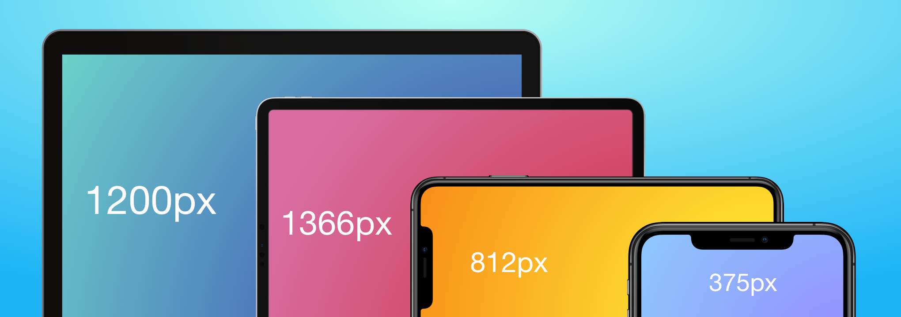

# Media Queries with React Native for iOS, Android, and Web

import { TwitterProfile } from "../../../components/embeds";

## The easiest way to create media queries universally!

**TL;DR:** [Demo Component](https://github.com/expo/match-media/blob/master/App.js)



A big open question we’ve had while developing Expo web is how would someone go about creating media queries.

A media query is a style rule that can be toggled based on device conditions. They’re a critical part of _easily_ building a responsive layout that works on many different screen sizes or orientations.

Because there are already so many incredible libraries out there for using media queries with React I figured the best approach for a universal system would be to polyfill native and reuse the existing eco-system. The result is `@expo/match-media` which enables you to use most of your favorite responsive React libraries with Expo.

More specifically it uses the native Screen Orientation module that comes with Expo to help you query when the orientation changes, it also observes the screen size for Android devices that use split screen functionality.

## Tutorial

For this example I’ll show you how to use [react-responsive](https://github.com/contra/react-responsive) universally in an Expo app. Of course [the readme](https://github.com/expo/match-media) will always have the most up-to-date information, but this probably won’t change much. 😁

First Install the packages:

```sh
yarn add @expo/match-media react-responsive
```

Then simply import the package at the root of your project (it’s a side-effect):

```js
import "@expo/match-media";

// Unleash the demo :D

import { useMediaQuery } from "react-responsive";

export default function App() {
  const isTabletOrMobileDevice = useMediaQuery({
    maxDeviceWidth: 1224,

    // alternatively...

    query: "(max-device-width: 1224px)",
  });

  if (isTabletOrMobileDevice) {
    return <Text>Hi Mobile Users 👋</Text>;
  }

  return <Text>👋 Hello Desktop People</Text>;
}
```

It’s that simple! Check out the docs for more information on what you can do with [React Responsive](https://github.com/evanbacon/react-responsive#with-hooks)! Now get out there and get queryinginging!

## Thanks for Reading

If you found this post useful then be sure to clap 👏 and follow for more :]

<TwitterProfile url="https://twitter.com/baconbrix" />

[**EvanBacon - Overview**
*Sign up for your own profile on GitHub, the best place to host code, manage projects, and build software alongside 40…*github.com](https://github.com/evanbacon)
[**expo/match-media**
*Universal polyfill for match media API using Expo APIs on mobile Install @expo/match-media in your project. yarn add…*github.com](https://github.com/expo/match-media)
