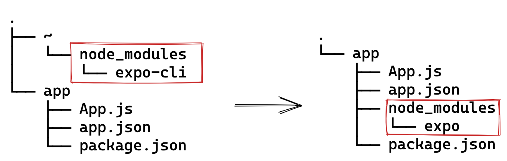

# Beta: Local Expo CLI

import { Embed } from "../../../components/embed";

We are very excited to announce the **beta release** of our new versioned Expo CLI that is installed locally in your project instead of globally on your computer.

Versioning the CLI offers the following benefits:

- **Longevity**: Projects will continue to work as expected for much longer since all of the tooling is versioned.

- **Stability**: We can safely deprecate features without risking projects breaking unexpectedly. The CLI will also have a proper beta period during the SDK beta releases. This will help us to ensure features are stable.

- **Automation**: CI will be simpler and easier to setup. No more caching global modules, configuring global versions, or unexpected version changes.

- **Speed**: The new CLI `npx expo` installs and updates substantially faster than `expo-cli`.

_Self contained dependencies make caching in CI easier._

## Testing

Enable the environment variable `EXPO_USE_BETA_CLI=1` then run `npx expo -h` to view the CLI commands.

**Features to test:**

- `npx expo start` — Starting the development server for your app.

- `npx expo prebuild` — Generating native code.

- `npx expo install` — Install versioned packages in your project. This command also comes with the new `--check` and `--fix` flags. You can even fix individual packages like `npx expo install --fix react-native expo-sms`.

- `npx expo export` — Bundle the JS and assets for hosting with [EAS Update](https://docs.expo.dev/eas-update/introduction/). This only supports the [new format](https://docs.expo.dev/technical-specs/expo-updates-0/#conformance) (`expo export --experimental-bundle` in the global CLI).

- `npx expo run:android` — Build Android projects locally. Now with the new `--no-build-cache` flag for running clean builds.

- `npx expo config` — View the project config for your app.

- We've also added the auth commands for signing manifests: `login`, `logout`, `register`, `whoami`.

## Known Issues

- Automatic web setup is buggy and requires restarting the process.

- Tunnels may have issues when running Webpack and Metro at the same time.

- Opening iOS simulators for the first time is slower than usual (make it work &gt; **make it right** &gt; make it fast).

## Beta Notice

Rewriting the CLI is a very large project, not all features are complete. Please report bugs on the `expo/expo` repo. You can continue to use the stable `expo-cli` for the foreseeable future, we will be freezing feature additions to ensure it remains stable. All new features will be added to the versioned CLI.

If for some reason you want to fully decouple the beta CLI from your project, you can resolve the `0.0.0` version which is blank.

```json
// package.json
{
  "resolutions": {
    "@expo/cli": "0.0.0"
  }
}
```

In the coming two quarters, we will also be releasing:

- `npx expo run:ios` -- Build iOS projects locally.

- `npx expo customize` -- Generate static project files (replacing `expo customize:web` ).

- Bundle command for Webpack (replacing `expo build:web`).

- Standalone tool for bootstrapping projects (replacing `expo init`).

- Standalone tool for upgrading projects to new versions (replacing `expo upgrade`).

If you are still using the deprecated `expo build` or `expo upload` commands, [please migrate to `eas-cli`](https://docs.expo.dev/build-reference/migrating/).

- 💬 Join us on [Discord](https://chat.expo.dev/) or the [forums](https://forums.expo.dev/) to discuss the release.

- ⭐️ Help us out by [starring Expo on GitHub](https://github.com/expo/expo), filing bug reports in [issues](https://github.com/expo/expo/issues), or opening [discussions](https://github.com/expo/expo/discussions) with questions or proposals.

- 🥓 Follow me on Twitter for more updates: [baconbrix](https://twitter.com/Baconbrix).

<Embed url="https://github.com/evanbacon" />
  
<!-- 
  [**EvanBacon — Overview**
  *You can't perform that action at this time. You signed in with another tab or window. *github.com](https://github.com/evanbacon)
-->
