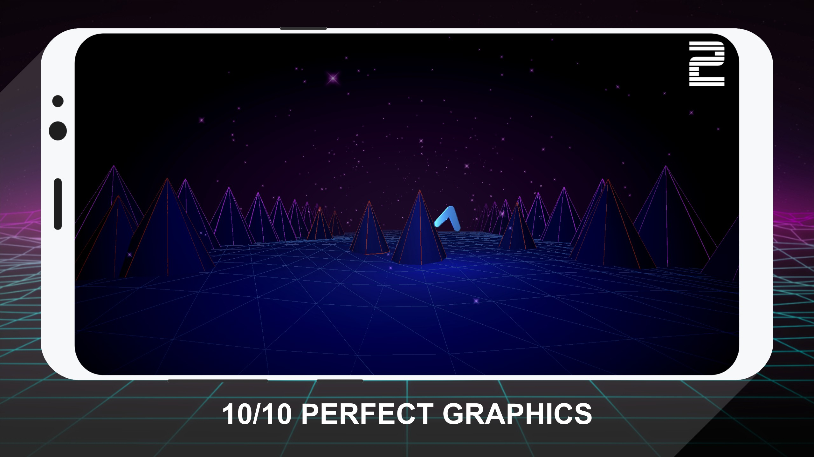

# Taking a stroll through Sunset Cyberspace

import { Embed } from "../../../components/embed";

## Taking a stroll through Sunset Cyberspace

At my last job I had to work on a Xamarin project — it was such an intense nightmare. I would come home everyday, and just like any moody teenager I started writing a poetic anti-tribute to fight the system.

As you can tell by this article, I'm not much of a writer, so instead I built an Expo app. Over the course of [3 angsty nights](https://twitter.com/Baconbrix/status/915951734769508353) I produced a game called [Expo Sunset Cyberspace](https://expo.io/@bacon/cyberspace): a ballad of the ultra master [Charlie Cheever](https://twitter.com/ccheever) and his battle to end subpar cross-platform native development platforms.

## The Story

The game spins a tall tale about when the evil Xamaronions inexplicably transported [Brent Vatne](https://twitter.com/notbrent) and [Nikhilesh Sigatapu](https://medium.com/@s.nikhilesh) to Xamaronia (or whatever made up name I came up with). Then a tall masculine shadow emerges from the darkness (of a fully neon world 🤷‍). When Brent and Nikki inquire about this neo-warrior's identity, he's revealed to be — The Man, The Myth, The Legend, [Charlie Cheever](https://twitter.com/ccheever). A revelation that can only be summarized as “😮😮😮😮😮😮😮”. Charlie then teaches how they must collect Exponium, a… mystical instrument type thing, I guess? (I don't know, I didn't really think that far ahead.) Anyways you get the point, it's incredible! 😅

## Gameplay

The game is pretty simple: you drag your finger around the screen collecting Exponium and avoiding spikes. Notice how very little overlaps with the story, in a nod to the classic confusing games, like [Night Trap](https://en.wikipedia.org/wiki/Night_Trap).

The game also incorporates massive amounts of natural human psychology: the spikes are red.

_Red = Bad, Pointy = Bad_

## I'm ready to commit for life. Where do I find it?

You can play the app on Expo

<Embed url="https://expo.io/@bacon/cyberspace">Sunset Cyberspace on Expo</Embed>

And the source code can be found on Github

<Embed url="https://github.com/EvanBacon/Sunset-Cyberspace">
  EvanBacon/Sunset-Cyberspace
</Embed>

You can download it on the [App Store](https://itunes.apple.com/us/app/sunset-cyberspace/id1332439319?ls=1&mt=8)

<Embed url="https://itunes.apple.com/us/app/sunset-cyberspace/id1332439319?ls=1&mt=8">
  Sunset Cyberspace on the App Store
</Embed>

It's also available on the [Play Store](https://play.google.com/store/apps/details?id=com.evanbacon.cyberspace)

<Embed url="https://play.google.com/store/apps/details?id=com.evanbacon.cyberspace">
  Sunset Cyberspace - Android Apps on Google Play
</Embed>

<!--
You can play the app on Expo
[**Sunset Cyberspace on Expo**
*A retro runner game!*expo.io](https://expo.io/@bacon/cyberspace)

And the source code can be found on Github
[**EvanBacon/Sunset-Cyberspace**
*Sunset-Cyberspace - Retrowave Game made in Expo, Three.js, OpenGL, WebGL, Tween.*github.com](https://github.com/EvanBacon/Sunset-Cyberspace)

You can download it on the [App Store](https://itunes.apple.com/us/app/sunset-cyberspace/id1332439319?ls=1&mt=8)
[**Sunset Cyberspace on the App Store**
*Read reviews, compare customer ratings, see screenshots, and learn more about Sunset Cyberspace. Download Sunset…*itunes.apple.com](https://itunes.apple.com/us/app/sunset-cyberspace/id1332439319?ls=1&mt=8)

It's also available on the [Play Store](https://play.google.com/store/apps/details?id=com.evanbacon.cyberspace)
[**Sunset Cyberspace - Android Apps on Google Play**
*A dope retro runner!*play.google.com](https://play.google.com/store/apps/details?id=com.evanbacon.cyberspace)

-->
