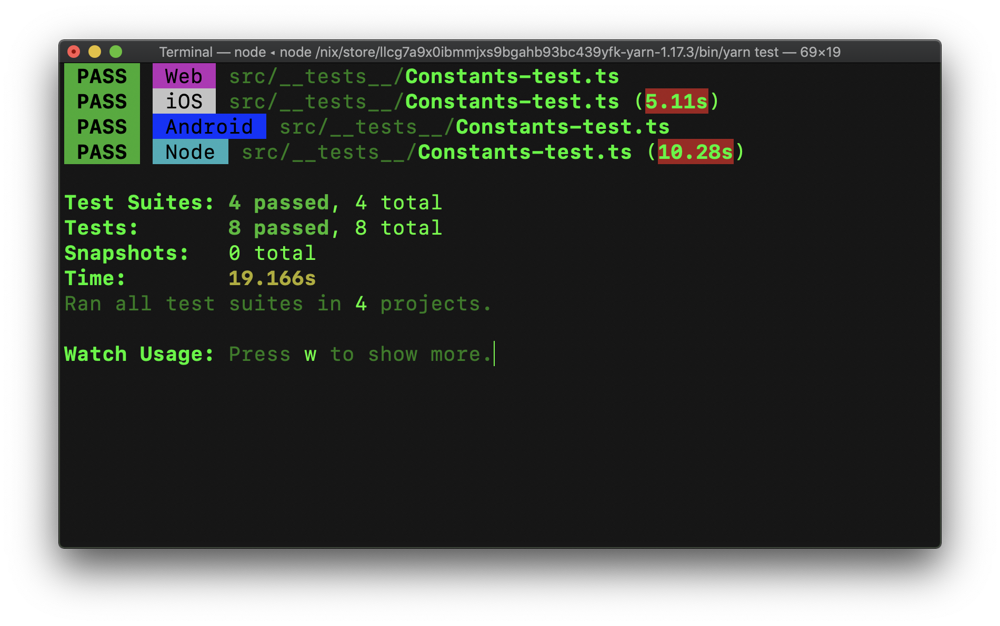
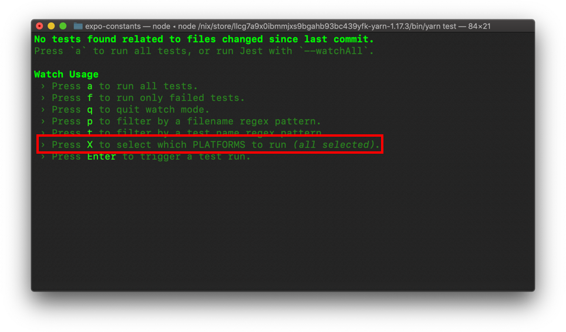
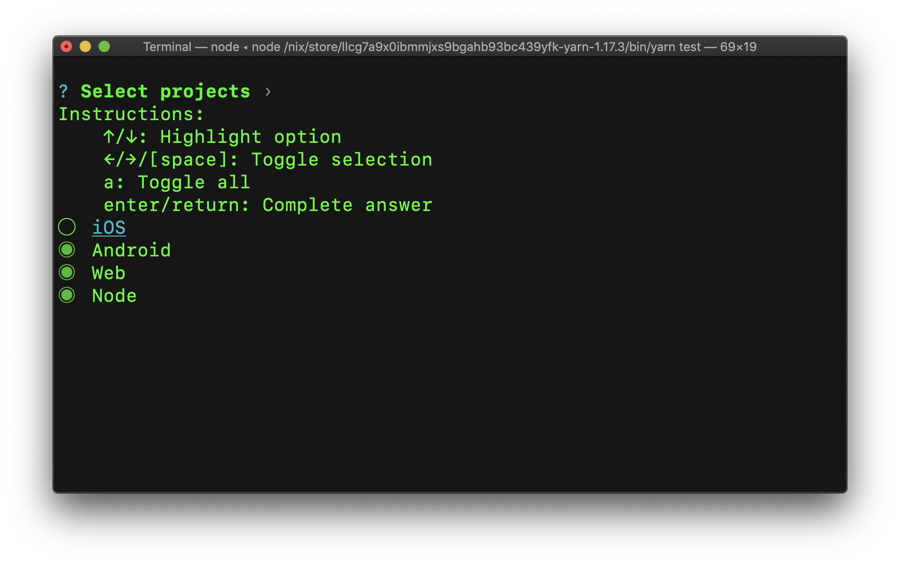
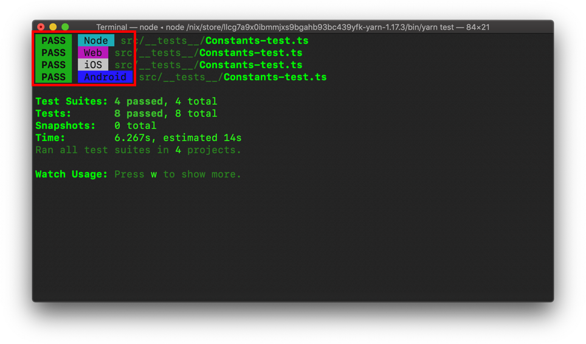
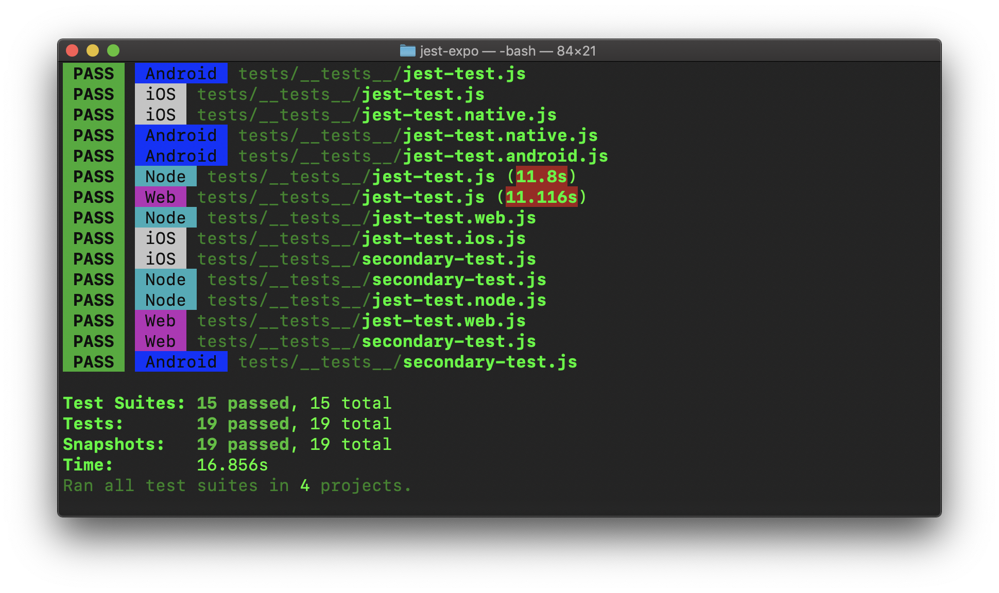
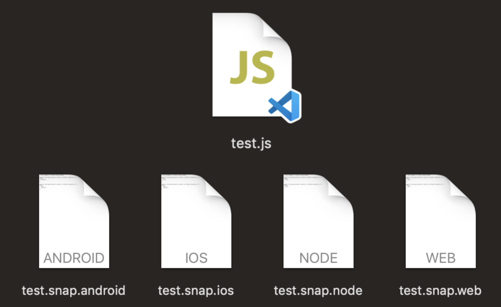
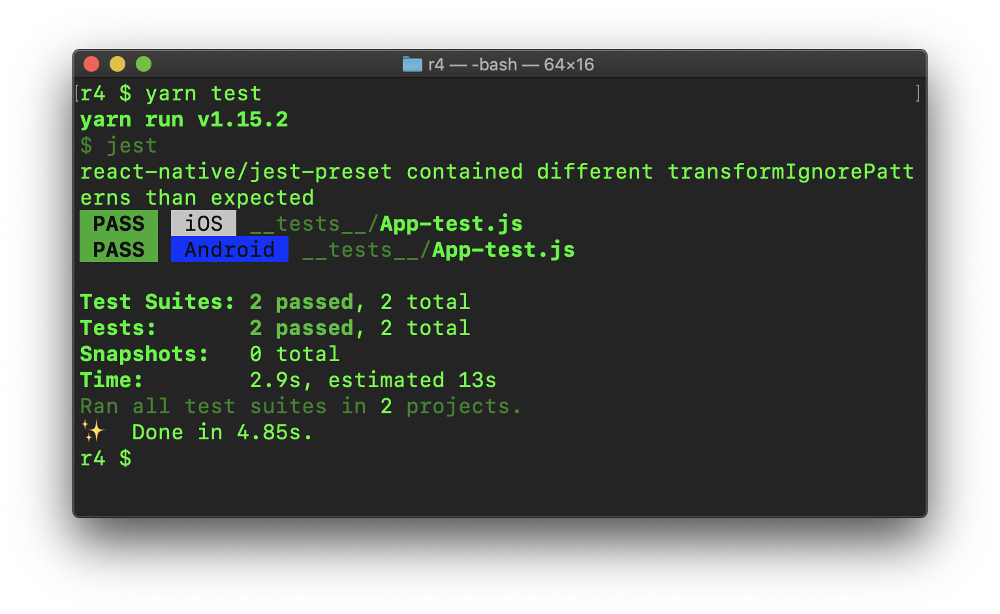
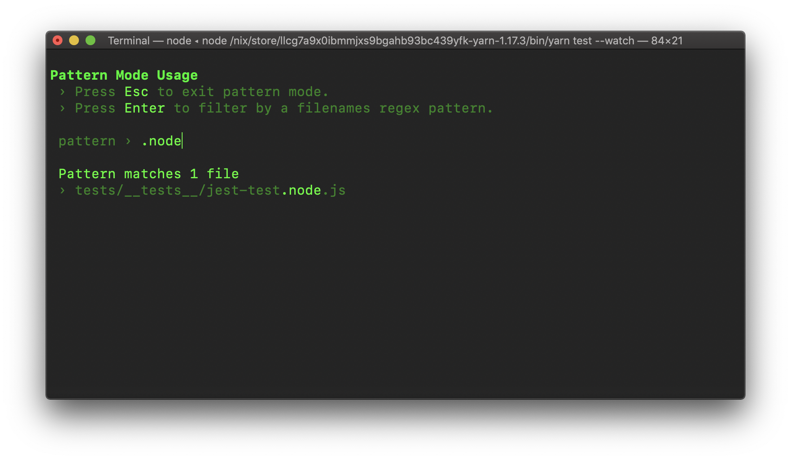

# Testing Universal React (Native) Apps with Jest and Expo!

import { TwitterProfile } from "../../../components/embeds";

## The official approach to testing your universal projects


Earlier this year we announced [web support for Expo](https://blog.expo.io/expo-cli-and-sdk-web-support-beta-d0c588221375) making it a universal framework for building apps. With this came a few big questions around stability and maintainability. For instance how would someone write a universal project and ensure that it works on _every_ platform.

Unit testing with Jest is an integral part of projects that are built with React. The tests run quickly and give us a wide variety of configuration options. But we’ve also found that sometimes entire classes of bugs slip through with several Jest configurations, such as the preset included with React Native, and the testing never seems to really _cover everything._

## 🤔 What’s wrong with the existing testing methods?

**TL;DR:** Existing approaches only test iOS code but never run Android, or web.

If you were to create a new React Native project now (late 2019) with the React Native CLI, you’ll be using the built-in Jest preset. With Expo CLI you use `jest-expo` which until _recently_ just composed the React Native preset with added mocks for Expo APIs.

The problem with these existing solutions is that you have just one Jest project that mocks out a single native platform to run the tests. It’s not entirely clear which platform that is when you’re using it but upon further digging of the source code [you’ll see it’s just iOS](https://github.com/facebook/react-native/blob/7a2463e1f396ffcfbd86e68170f624d31a1be4e1/jest-preset.js#L14).

This means that any unexpected behavior on Android, web, or Node (SSR) is completely overlooked! Here are a few clear examples of problems that will all be missed when using the React Native Jest preset.

1. The Platform API is mocked to iOS so the following is true: `Platform.OS === 'ios'` and `Platform.select({ ios: 'ios', default: 'other' }) === 'ios'`

```js
import { Platform } from 'react-native';

if (Platform.OS === 'ios') {
  // ✅ Works in tests!
  console.log('Everything is great! 😁')
} else {
  // 🛑 Fails in production :[
  // Android, web, macos, windows, etc...
  throw new Error(`WHY DIDN'T YOU TEST MEEEH 😭`)
}

const value = Platform.select({
  // ✅ Works in tests!
  ios: 'Push to production!',
  // 🛑 Fails in production :[
  default: `I really hope it's not Friday`
});

get doesMyCodeWork(): boolean {
  switch (Platform.OS) {
    case 'ios':
    // ✅ Works in tests!
    return true;
    default:
    // 🛑 Fails in production :[
    return false;
  }
}
```

2. The aforementioned Jest presets configure the module resolver to look for files ending in `.ios.js` and `.native.js`, which means anything else like `.android.js`, `.web.js`, `.macos.js`, `.windows.js`, or `.yournewos.js` will not be imported or tested.

```js
// > 📁 **Module.ios.js**

export // Expected values...
 {};

// > 📁 Module.web.js, Module.android.js, Module.windows.js, etc...

export // Unexpected values...
 {};

// > 📁 MyCode.js

import /* Expected values */ "./Module";

// 🛑 Will fail in prod but pass in tests!
```

So even if you write extremely thorough tests they may not cover code that ends up failing in production because a lot of platform-specific features are never even executed!

## ✅ Solution: A Universal Testing Preset

**TL;DR:** `[jest-expo@^35.0.0`](https://github.com/expo/expo/tree/master/packages/jest-expo)

_A universal platform test runner for Jest_

In order to create sturdy, well-tested universal libraries (like [\*\*these](https://github.com/expo/expo/tree/master/packages) \*\*packages) we needed to create a completely new way for ensuring that all API code was covered. The result is `jest-expo@^35.0.0`, which is the first universal testing preset for React.

`jest-expo` works by recomposing the React Native Jest preset with platform-specific module resolution, then running all of the unit tests on every platform you’re supporting. (More info on why this wasn’t just upstreamed at the bottom).

### 🤝 Framework Agnostic

`jest-expo` can scale down to work with _any_ React Native project. The `expo` name simply means that it provides coverage for the underlying platforms Expo supports, which are currently iOS, Android, web, and Node (for server-side rendering). We built it in a very composable way so you can run it with tools that don’t support all of the platforms Expo runs on.

**Important: **Check the migration section for more info on how to do universal testing with bi-platform (iOS & Android only) React Native projects.

## 📦 Installation

In universal projects made with Expo CLI you can simply run `yarn add --dev jest-expo@^35.0.0` and change the Jest preset in `package.json`:

```json
// package.json

"jest": { "preset": "jest-expo/universal" }
```

👉 For backwards-compatibility, the preset `jest-expo` is currently an alias for `jest-expo/ios`.

## 🎮 Usage

Run `yarn test --watch` or `yarn jest --watch` to start the test runner in watch mode, then you may notice the new options with the **X (⇪x)** key which will enable you to choose which platforms you want to test.

\*You can now select which platforms you want to test by pressing **X\***

Just like with developing an app, you probably won’t want to test every platform at the same time. Because of this we’ve added the option to choose which platforms you want to run in the terminal.

_Press **X **to open the platform selection dialog_

You’ll now notice that your tests are being run multiple times, each with a different platform. This means that all platform specific features and conditionals can be covered and no bugs are missed.



### ➕ React Native Platform API

You can now use the Platform API from React Native in your tests to conditionally run platform specific tests in the same file as well:

```js
import { Platform } from "react-native";

if (Platform.OS === "web") {
  it(`does a web thing`, () => {});
}
```

The Platform API is correctly mocked out so the application code you are testing will be aware of which conditions should be executed on a platform.

## 🔮 Platform Extensions

You may find that some tests shouldn’t be universal and instead should only run in either native (Android, iOS, etc…) or web environments. Because of this we’ve added **platform-specific test resolution**. You can specify which tests run on which platforms by using platform extensions like these:

```sh
- Example-test**.ts** : All platforms will run these tests
- Example-test**.ios.ts** : iOS only
- Example-test**.android.ts** : Android only
- Example-test**.native.ts** : iOS & Android
- Example-test**.web.ts** : Web and Node (SSR)
- Example-test**.node.ts** : Node (SSR) only
```



**Very Important: **These extensions are additive, meaning that if you had a file with `.ios.ts` and a file with `.native.ts`, the **tests from both files will run**. This is different from the bundler resolution where `.ios.ts` would take precedence over `.native.ts` and `.ts` files.

_Node runs all: `node.js, web.js, .js`_

### 💥 Snapshot Testing

One of my **favorite new features** is the multi-platform snapshot testing. This enables you to use different snapshots for each platform!

For instance imagine you had a snapshot test in `Example-test.native.ts` that saves the `Platform.OS` as a snapshot. When running the tests, Jest will first create `Example-test.native.ts.snap` with the contents `"ios"`. Then, it will run the test again as Android, overwriting the snapshot’s contents with `"android"`. This means when you run the tests again, `Platform.OS` will first be `"ios"` but the snapshot will contain`"android"`, causing the test to undesirably fail.

_Universal snapshot testing that scales_

The solution to this is to read and write **platform-specific snapshots** with a platform extension so each platform can compare the correct results. When using **jest-expo/universal**, a test like `Example-test.native.ts` will run as iOS and Android then write the snapshot contents to `Example-test.native.ts.snap**.ios`** and `Example-test.native.ts.snap**.android`\*\*, respectively.

```
> 📁 Example-test.js

import { Platform } from 'react-native';

it(`Platform.OS works as expected`, () => {
    expect(Platform.OS).toMatchSnapshot();
});

> 📁 __snapshots__/Example-test.js.snap.android

exports[`Platform.OS works as expected`] = `"android"`;

> 📁 __snapshots__/Example-test.js.snap.ios

exports[`Platform.OS works as expected`] = `"ios"`;

> 📁 __snapshots__/Example-test.js.snap.node

exports[`Platform.OS works as expected`] = `"web"`;

> 📁 __snapshots__/Example-test.js.snap.web

exports[`Platform.OS works as expected`] = `"web"`;
```

You should **avoid inline snapshots** unless you want all platforms to match the exact same value. This feature was added because we needed to snapshot test the styles for `[expo-linear-gradient`](https://github.com/expo/expo/tree/master/packages/expo-linear-gradient/src/__tests__)\*\* \*\*and we wanted the web version to have CSS and the native version to have computed native styles.

## 🎒 Migration Guide

### 🌟 Universal Projects

Assuming you’re using **jest-expo** or **react-native** for your Jest preset; there are three ways you can migrate your existing tests:

1. Update or install `yarn add --dev jest-expo@^35.0.0`. The `jest-expo` package works great with Expo projects, and remember it is completely agnostic and works with other Android and iOS projects that use React Native, with no dependencies on other Expo libraries.

1. Migrate your tests without breaking them:

- **A. If you plan on making your tests universal:** Use the `jest.preset: jest-expo/universal` value in your `package.json`,run your tests (`yarn jest`), then press “X” and deselect every platform except iOS.

- **Note:** If you use `jest-expo/universal`, `jest-expo/web`, or `jest-expo/node` you’ll need to install `react-native-web` and `react-dom` (this only applies to **bi-platform CLIs like react-native-cli**).

- **B. You don’t want to add any new platform support:** Use the iOS only preset `jest-expo/ios`. This is essentially what you previously had but with possibly a little more thorough module-resolution config.

- **C. You want to write new tests for all other platforms: **Use `jest-expo/universal` then rename your tests from `MyCoolModule-test.js -&gt; MyCoolModule-test.ios.js` which means only the iOS runner will be used. You can then add different test files for the other platforms. Alternatively the **React Native Platform API works as expected in `jest-expo` **so you can also just wrap all of your tests in `if (Platform.OS === 'ios') {}`

### ✧ Native-only Projects

_jest-expo can be scaled back and used for native-only systems_

If you’re using a bi-platform tool like [Ignite CLI by Infinite Red](https://github.com/infinitered/ignite) or [React Native CLI by react-native-community](https://github.com/react-native-community/cli) you can create a preset that supports just iOS and Android like so:

```json
// package.json

// 🛑 Replace (iOS only)
"jest": { "preset": "react-native" }

// ✅ With this (iOS and Android)
"jest": {
  "projects": [
    { "preset": "jest-expo/ios" },
    { "preset": "jest-expo/android" }
  ]
}
```

- **Note:** If you use `jest-expo/universal`, `jest-expo/web`, or `jest-expo/node` you’ll need to install `react-native-web` and `react-dom` (this doesn’t apply to projects made with [Expo CLI](https://docs.expo.io/versions/latest/workflow/expo-cli/) or [Snack](https://snack.expo.io)).

## **💫 Future Plans**

### Style Testing with Enzyme

We’ve also created a library for testing how components are rendered called `**jest-expo-enzyme` \*\*which is still in beta. This just conveniently adds Enzyme support to `jest-expo` (which was annoying to do manually). I use this library to test visual components like `expo-blur`, `[expo-linear-gradient`](https://github.com/expo/expo/blob/9f2770d366a212a3ccddc8d209daf9c185481f8b/packages/expo-linear-gradient/src/__tests__/LinearGradient-test.native.tsx#L6-L17), and `expo-gl`. You can use it today, but expect more on this in a future post.

### Universal Test Coverage

Now that you can truly test all of your universal code, you’ll probably want some method for seeing how much coverage you’ve got. This is a tricky problem we are working on at Expo and will be rolling out in the future. Still a lot of questions around what a meaningful coverage report will look like for a universal project.

### **End-to-End Testing for Web**

Another (more fun) library we’ve rolled out is `jest-expo-puppeteer`, which is also still in beta. You can use this library to automatically run your Expo web project in a Chrome environment.

## ⬆️ Why Not Just Upstream?

My initial thought was to try and upstream these features to React Native but there are a few reasons this is a bad idea.

1. The **React Native Jest preset is actually doing exactly what it should be doing. **It mocks out React Native APIs and adds support for the features in its own package.

1. The package `react-native` doesn’t have web support. To support web you alias the string `react-native` to `react-native-web` . Having the RN Jest preset be aware of some platforms and not others felt like a regression.

1. What was really missing was a library which composed the presets together and prevented the need to download out-of-tree packages like `react-native-web` if you didn’t use web. The approach we settled on felt like the most universal and scalable approach possible.

## 👏 Special Thanks

Thanks to [\*\*James Ide](https://github.com/ide)** and [**Simen Bekkhus](https://github.com/SimenB)\*\* for all of their help reviewing PRs and giving feedback!

## 👋 Thanks for Reading

If you have any questions, please feel free to tweet at Expo or me:

<TwitterProfile url="https://twitter.com/baconbrix" />

### Check out the README for more information on extending the preset

[**jest-expo**
*A Jest preset to painlessly test your Expo apps. If you have problems with the code in this repository, please file…*www.npmjs.com](https://www.npmjs.com/package/jest-expo)

### ⭐️ Star the Repo on Github!

[**expo/expo**
*Check out our documentation https://docs.expo.io to learn more about developing with Expo. Expo is an open-source…*github.com](https://github.com/expo/expo)

_Also jest-expo now has type-ahead 😍_
