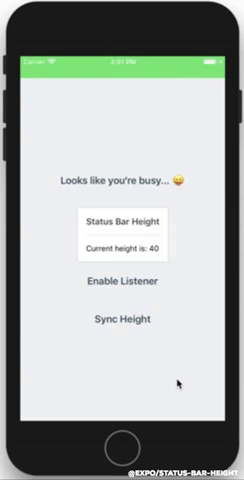

# The Status Bar Manager in React Native

## 🚨 In iOS 14+ the status bar is now regular height, therefore this package has been deprecated in favor of react-native-safe-area-context which is available in Expo Go, and integrated in React Navigation!

**TL;DR** I made this library: [https://github.com/expo/status-bar-height](https://github.com/expo/status-bar-height)



I saw a [post on the Expo forums](https://forums.expo.io/t/incoming-call-phone-or-skype-or-a-connection-sharing-when-the-app-is-loaded/7086/5) recently about how to handle when the “background-task” makes the status bar change in height.

Upon further research I noticed this is a fairly undocumented topic (this may have to do with how obscure the feature is 😝).

After reading a bunch on this, and scouring the React Native source code, I decided I should share my findings in one place.

## Implementation

Firstly, it’s important to note that you don’t access the `StatusBar` height through `ReactNative.StatusBar`; instead, you need to import a native module called `StatusBarManager`.

```
import { NativeEventEmitter, NativeModules } from ‘react-native’; const { StatusBarManager } = NativeModules;
```


From here, it’s actually pretty easy — you just use the imperative API and call things such as getHeight: a function with a callback that you use to…, well, get the status bar height 😝.

```
StatusBarManager.getHeight(({height}) => {});
```


“expo/status-bar-height” wraps this API for silly reasons that I’ll explain shortly…or right now :]

## The Silly Reason 🌝

In iOS you can detect the status bar height changes by observing two keys: `UIApplicationWillChangeStatusBarFrameNotification` and `UIApplicationDidChangeStatusBarFrameNotification`. Can you guess which one actually returns the new frame? …you guessed it! It’s the `WillChange` one 🙃.

I really don’t have an explanation for this because it’s described incorrectly in the [Apple official documentation](https://developer.apple.com/documentation/uikit/uiapplicationwillchangestatusbarframenotification?language=objc️) 🍎.

To add insult to injury, these calls aren’t directly swapped: `willChange` is still called before `didChange` (the expected behavior). Because of this we can’t just swap the values and call it a day 😓.

As a remedy, I wrote the expo/status-bar-height API to use only `willChange`, which means no key is passed to the listener.

```
StatusBarHeight.addEventListener((height) => {})
StatusBarHeight.removeEventListener((height) => {})
```


### Async Height

If you’d like to get the height without listeners, you can do so with the following:

```
const height = await StatusBarHeight.getAsync();
```


### Unsafe Height

If for whatever reason you don’t want to call the async `getHeight` method, the last value is cached and accessible. This could be used for interactions connected to a ScrollView.

```
StatusBarHeight.height
```


### Indecisive naming

Because EventEmitter is confusing to me (I’m not a smart person 😭), I added all formats for the listener API:

```
StatusBarHeight.addEventListener()
StatusBarHeight.addListener()
StatusBarHeight.on()
...
StatusBarHeight.off()
StatusBarHeight.removeListener()
StatusBarHeight.removeEventListener()
```


### Finally

Thanks for reading my rant 🤓 — this hopefully creates less confusion for future devs. Special thanks to [Laurent Roger](https://forums.expo.io/u/lc3t35/summary) for identifying this issue! 💙💙

Tinker with it at [https://snack.expo.io/@bacon/status-bar-height-example](https://snack.expo.io/@bacon/status-bar-height-example)
[**Add StatusBar height constant and improve implementation by janicduplessis · Pull Request #6195 ·…**
*This adds a HEIGHT constant on StatusBar on Android. I needed only this for now but I will work on a better status bar…*github.com](https://github.com/facebook/react-native/pull/6195)
[**expo/status-bar-height**
*status-bar-height - Listen to status bar changes during incoming calls and other multi-tasking events*github.com](https://github.com/expo/status-bar-height)