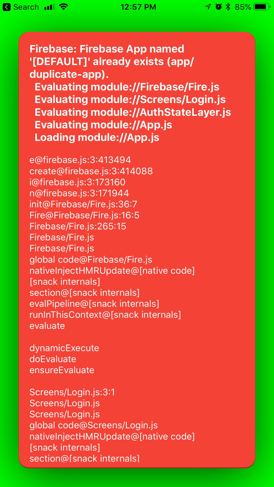

# Using Web Firebase SDK in Expo Snack

import { Embed } from "../../../components/embeds";
import Thanks from "../../../components/thanks";

## TL;DR: if (!firebase.apps.length) firebase.initializeApp({ … }); instead of firebase.initializeApp({ … });

If you have tried using Firebase in a [snack.expo.io](https://snack.expo.io/) you may have noticed that the hot reloading will cause it to throw errors and not function properly.

```sh
Device: (78:20) Firebase: Firebase App named '[DEFAULT]' already exists (app/duplicate-app).
  Evaluating module://Firebase/Fire.js
  Evaluating module://Screens/Login.js
  Evaluating module://AuthStateLayer.js
  Evaluating module://App.js
  Loading module://App.js
```



Fixing this is very simple. Just check to make sure the app hasn't been initialized before calling `firebase.initializeApp({ ... });`

### You can do that like this:

```js
if (!firebase.apps.length) firebase.initializeApp({ ... });
```

It's kinda upsetting that firebase doesn't just throw a warning and tell you what to do. 🙃

<Embed url="https://snack.expo.io/embedded/@bacon/firebase-initialize-app" />

<Thanks />
