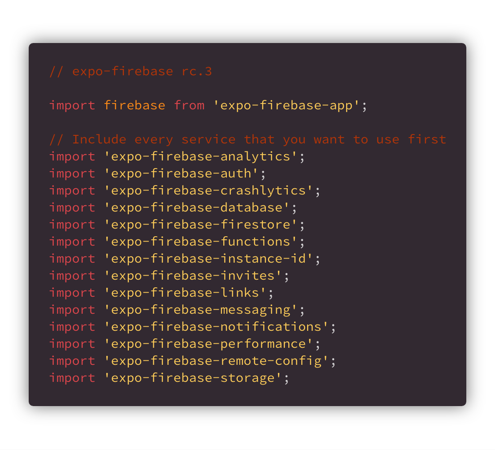
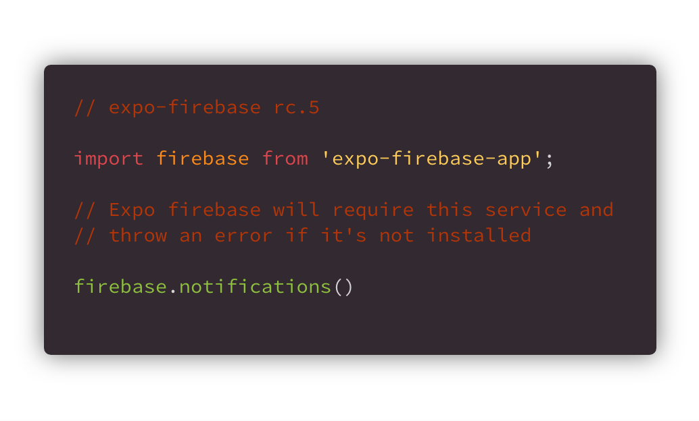
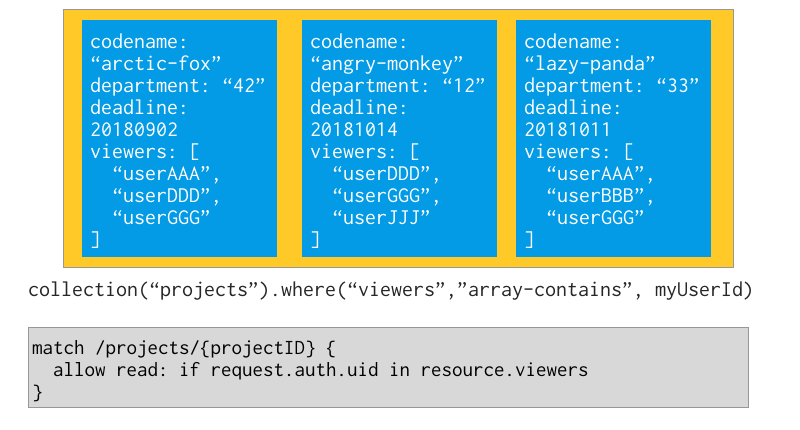
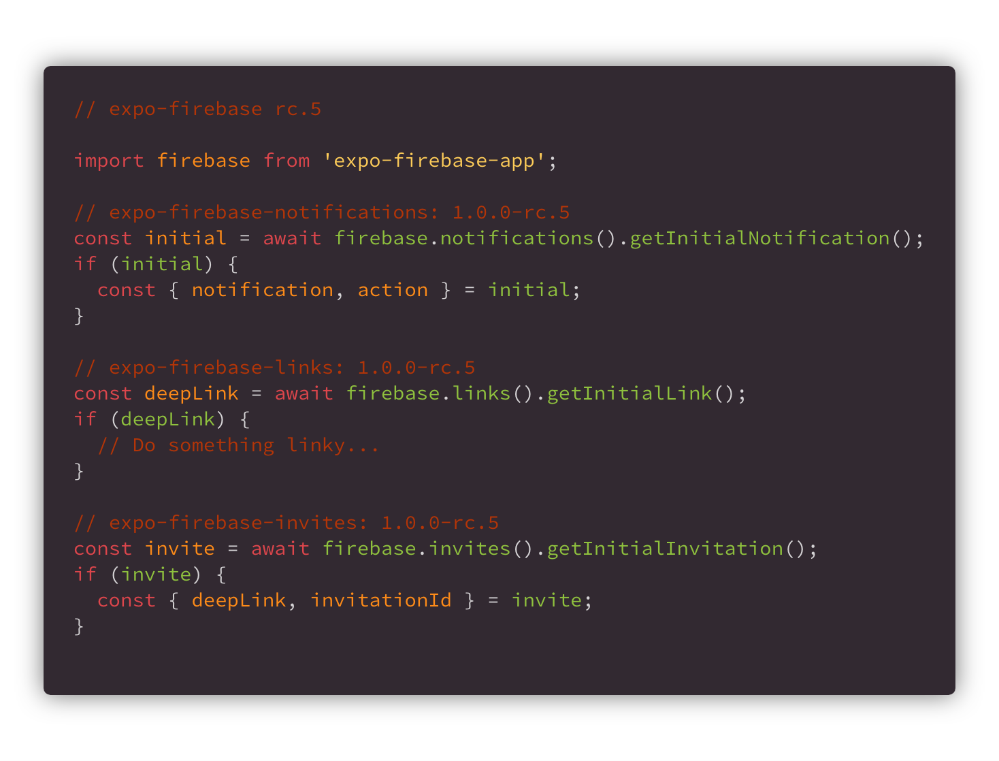

# What’s New in Expo-Firebase rc.5

## TL;DR: It’s not in the client yet

Hey Expo/Firebase users, we have an exciting new update for you! This one is full of bug fixes, and even has a couple new features! 🔥



*Before / After*

## No more extra imports

TL;DR: You can just Copy & Paste 😁

```
import firebase from ‘expo-firebase-app’;
```


In trying to cut down on bundle size, I split each Firebase service into its own package: this has been really great for cutting down on bugs and keeping out code that you may not (or don’t care to) understand.

This meant that where you once had to import the libraries you wanted to use before using them, you can now just use whatever service you want. Internally, expo-firebase checks to see whether it’s installed, and if it is then we’ll automatically register the service for use.

## [Firestore Array](https://firebase.googleblog.com/2018/08/better-arrays-in-cloud-firestore.html) Features

All of your favorite array methods are now available in Expo-Firebase.

`arrayUnion()` which will add elements to an array which are not already present, and `arrayRemove()` which will remove all instances of each element provided.

My personal favorite: you can now use the `array-contains` query 😍. (Special thanks to [Elías Daniel Turbay](https://twitter.com/eliasturbay) for doing some digging on this 🔥 Check out [some of his stuff here](https://blog.expo.io/expo-featured-developer-elias-turbay-27b0f59f6938).)

*A neato diagram from Firebase…figured I’d shake it up and not use carbon for everything. 😅*

## Initial Operations

We upgraded the expo-core Unimodules, so now events that trigger your app to be opened can be interacted with.



For instance, if you were to tap a notification and it opened your app, if you opened an invite link, or even if you just opened a Google Deep Link.

## Dropped iOS 9

Removing the old iOS Notification system has cut down on a lot of needless complexity and made it possible to start adding more robust iOS 12 notification features, and actions. 😘😍Next time though:
SyntaxError: Unexpected token w in JSON at position 10

## Other Things…

A couple more things, I was too lazy to generate images for:

### Production Ready

We are still trying to work through a couple more big features before I put out an official first version. Of course there is nothing stopping you from rolling this into production (as a few developers already have 🧡) just do so at your own risk. Because it is in “RC” I will push breaking changes to the API, so remember to thoroughly upgrade your modules `yarn upgrade` `pod install` & Sync your gradle again.

### Bug reporting

Although this project is based on RNFirebase, their team have asked that you report Expo bugs on our repo. All the features listed above were all reported and are now closed, so it’s safe to say you will get assistance 😁
[**Build software better, together**
*GitHub is where people build software. More than 28 million people use GitHub to discover, fork, and contribute to over…*github.com](https://github.com/expo/expo/issues/new)

### Unit Tests

Added the unit tests to the modules, feel free to check them out. Still a little janky while we wait for Detox to be fully integrated in expo.

### Is it in the Expo Client Yet?

Nope. But one day 💙

### Tutorials

Detaching is still pretty complex, I put together some video tutorials for ejecting and adding Expo-Firebase 🔥consider giving them likes for SEO/EGO purposes 😜
SyntaxError: Unexpected token w in JSON at position 10

## Future Plans

* Integrate background tasks

* Add E2E with Expo-Detox

* Add to the Expo turtle build for Standalone apps

* More robust iOS notifications

* More examples of usage with other Expo APIs

## Thanks

To everyone who has supported this project:

* [Mike Diarmid](https://twitter.com/mikediarmid) & [Elliot Hesp](https://twitter.com/elliothesp) Co-Creators of RNFirebase

* [Elías Daniel Turbay](https://twitter.com/eliasturbay) for helping with Array features

* [Markus Gray](https://github.com/cryptixcoder) for reporting Expo Firebase issues

* [redpandatronicsuk](http://github.com/redpandatronicsuk) for reporting the require cycles

* [Eric Samelson](https://medium.com/@esamelson-expo) & [Stanisław Chmiela](https://twitter.com/sjchmiela) for reviewing PRs

## That’s it!

If you made it this far, I love you 😘If you wanna support, consider staring the Expo repo, subscribing to the Youtube channel, or giving 50 claps 👏 so I can feel like I know how to grammar! 😁
[**React Native Firebase — Simple Firebase integration for React Native**
*Simple Firebase integration for React Native with support for 10+ Firebase modules including Authentication, Analytics…*rnfirebase.io](https://rnfirebase.io/)
[**Subscribe on Youtube **
*Expo is a free and open source toolchain built around React Native to help you build native iOS and Android projects…*t.co](https://t.co/9prx8STLwx)
[**Star on Github!! ⭐️**
*The Expo platform for making cross-platform mobile apps - expo/expo*github.com](https://github.com/expo/expo)
[**Follow me on Twitter for more updates!! Evan Bacon 🥓 (Baconbrix)**
*The latest Tweets from Evan Bacon 🥓 (@Baconbrix). 💙 Working on @expo & #React 🔥 #AR 🥓 Lego master builder 😱 I like…*twitter.com](https://twitter.com/baconbrix)