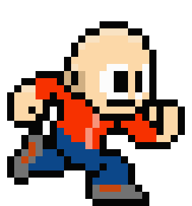

# What's On The Gaming Shelf! 👾

import { Embed } from "../../../components/embeds";
import Thanks from "../../../components/thanks";

## There once was a time that I was putting out new content every day! With no girls, friends, or responsibilities I was devoting all my time to making cool Expo stuf…so what's changed?

Well, nothing.

I'm just trying to build way overly ambitious things lately and a lot of stuff has been sitting on the shelf 😏. So I figure I'd show you guys a some examples of what Expo gaming advancements in Expo libraries like [Phaser](http://phaser.io), [Pixi](http://pixijs.io/), and [Three](http://threejs.org/) will bring!

## The Games

> Let's start strong and just tumble downhill.

- **Code Clash**
- **Exponots**
- \*\*Hotline Expo
- **ExpoCraft**
- **Crossy Platform**

### Code Clash

This game pits community members against one another in a 2D _Super Smash Bros_-type brawl. I was working on this for Expo Jam v26, I think I ended up just making space invaders 😂 I'm still working on my pacing. ¯\_(ツ)\_/¯

_Mock UI made in snack_

UI Source 👉 [https://snack.expo.io/@bacon/smash-text-scaled](https://snack.expo.io/@bacon/smash-text-scaled) 👈

Each character is made in Dragon Bones and exported as spine data. For some characters I had to get a little creative, Skevy for instance isn't known for have a pink jacket but he work at AirBnB now 😏😝 Every user icon would have their affiliated group icon just like in Smash Bros. except for [Ken Wheeler](https://twitter.com/ken_wheeler), I made his special 😇

_Lil wheeler + yeezys_

I kept the bodies similar so the animations could be reusable. DragonBones was super easy to use, and the characters were made in Sketch.

_I didn't ask anyone's permission to use their likeness btw 🤷‍_

Currently I have [Ken Wheeler](https://twitter.com/ken_wheeler), [Charlie Cheever](https://twitter.com/ccheever), [jesseruder](https://twitter.com/jessekruder), [James Ide](https://twitter.com/JI), and [Adam Miskiewicz](https://twitter.com/skevy). (Aren't they masterpieces? 😂 I just took a shot in the dark for the muscles. 💪 )

[Tweet at me](https://twitter.com/baconbrix) or comment with other dope programmers I should add. 😁 Maybe something diverse… 😅

_As you can see, there are some kinks_

Also [James](https://twitter.com/JI) really does dress like a penguin around the office sometimes. 🐧

### Exponots

Source: 👉 [https://github.com/EvanBacon/Expo-Super-Mario-World](https://github.com/EvanBacon/Expo-Super-Mario-World) 👈

Exponots is inspired by Super Mario World. Basically you run around and do some collecting, and jump on players, effectively squishing them.

_Baby Wheeler — lol mega man_

Exponots is meant to be a multiplayer experience. I always loved the DS New Super Mario which let you jump on one another's heads while racing to a star. What better way to unite people than a game based on trolling other users…?? 😁🤷‍

_Mini Cheever_

(I use [Charlie Cheever](https://twitter.com/ccheever) and [Ken Wheeler](https://twitter.com/ken_wheeler) a lot because they're the ones I'm most confident won't sue me. 😅)

This app is made using [expo-phaser](https://github.com/expo/expo-phaser), and the production is actually pretty straight forward. The audio is a little janky and needs some work.

Not sure what I want to do for multi-player yet, probably pubnub (I'm dyslexic 😉) or Firebase. Open to suggestions, and always open to PRs!

### Hotline Expo

This one is a game version of opinionated programming. You can create the story you want and send it to friends to illustrate how you feel about other frameworks or topics. Of course, your message will be delivered with the loving delicacy Hotline Miami is known for… 🌞😂 I didn't really code this one yet, but that's just cuz I'm lazy. ¯\_(ツ)\_/¯

### [Expo Craft](https://github.com/EvanBacon/Expo-Voxel/tree/chunks)

Source: 👉 [https://github.com/EvanBacon/Expo-Voxel/tree/chunks](https://github.com/EvanBacon/Expo-Voxel/tree/chunks) 👈

My first public Expo project was a voxel engine. I've really wanted to build a full scale clone (of that one game 😉) that utilizes [voxel.js ](http://voxeljs.com/). It's somewhat working but pretty laggy because I code like human pelican. 🦆

These usually do really well on App Stores when they're free. ⭐🔥CLOUTTT 💙👾

### [Crossy Platform](https://github.com/EvanBacon/Expo-Crossy-Road)

Source: 👉 [https://github.com/EvanBacon/Expo-Crossy-Road](https://github.com/EvanBacon/Expo-Crossy-Road) 👈

Crossy Platform is the open source hopper you'll never want to put down! My initial clone was ok but the source material was kinda trashy so I plan to make something really great from this eventually ❤

## Finally

As you can see gaming in Expo is really fun and easy, it makes use of lots of popular libraries that are well supported and well documented. All I need to do now is actually finish some of this stuff. 😅😝😬

Let me know what you think of these, and whether they're worth continuing to pursue. Suggestions, alterations, or ideas about what could make these better are always appreciated. ❤️ (Of course you could also take any of these and run with them or spin-off — it's all open and all yours! 😻😎)

I think it's also worth mentioning that most of these are hacked together. If you are new to the open-source world and want some experience contributing, these are a good low-to-no pressure repos. The [Expo community ](http://slack.expo.io)is also the friendliest of coding communities so don't worry about looking like a n00b. 😁😘😇

<Thanks />
