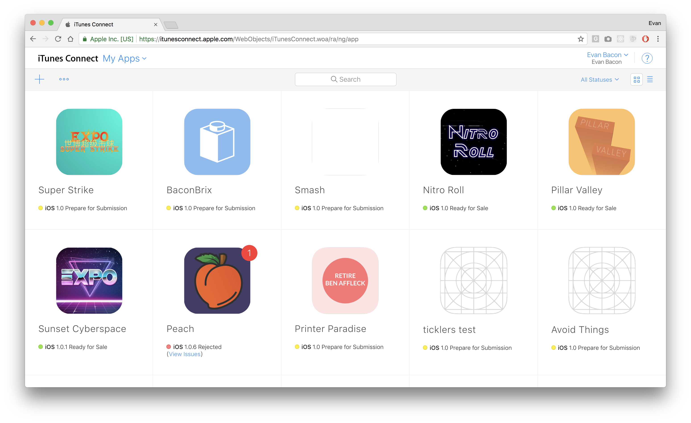
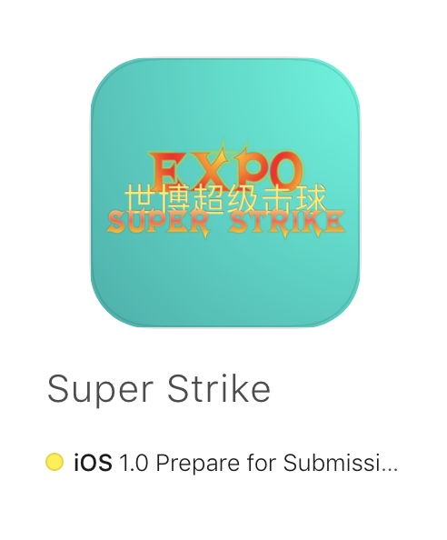
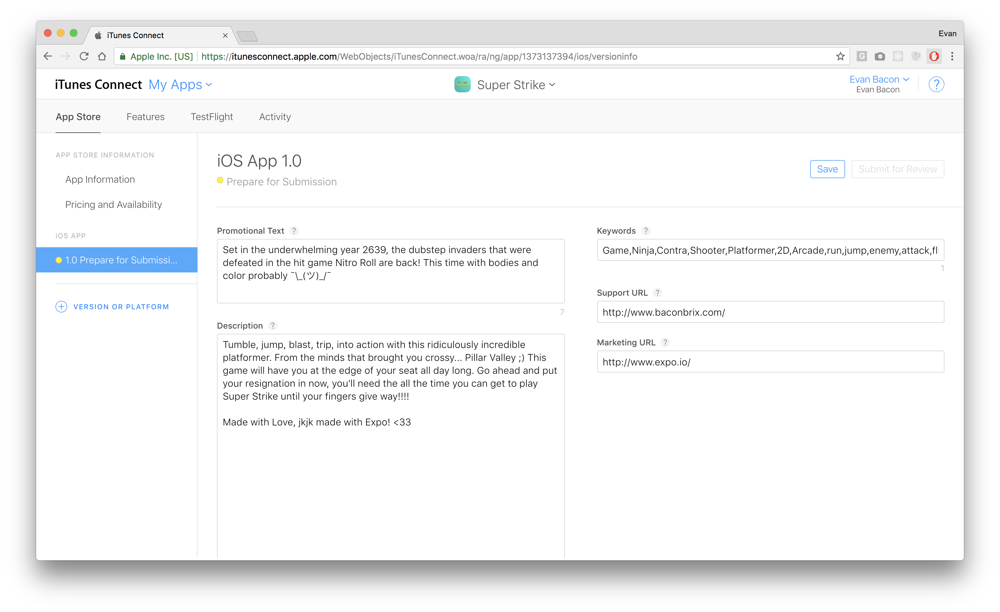
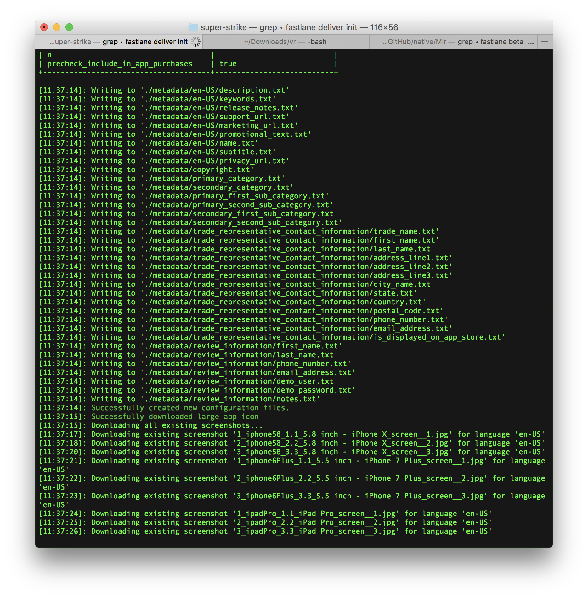
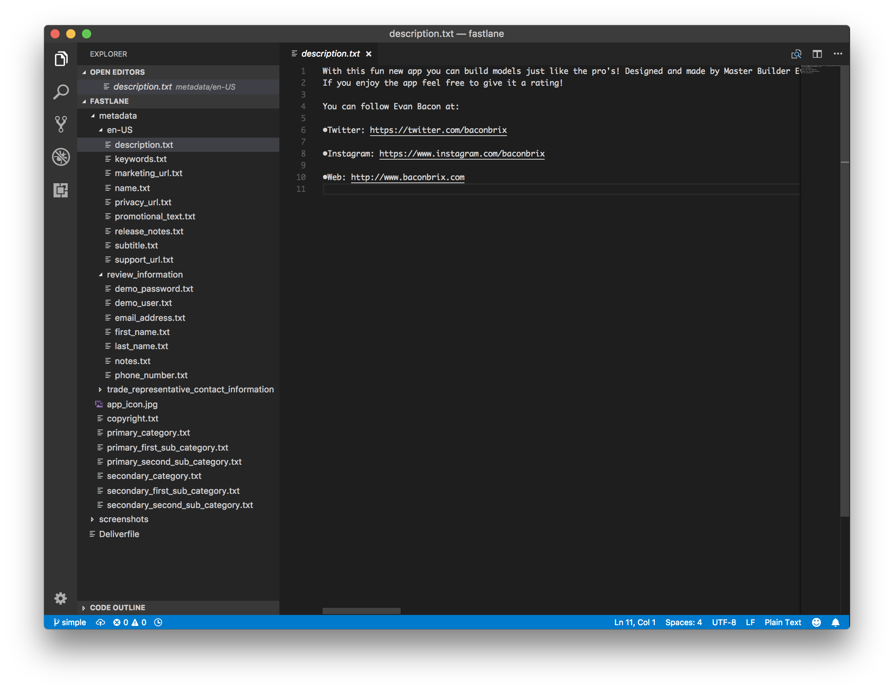
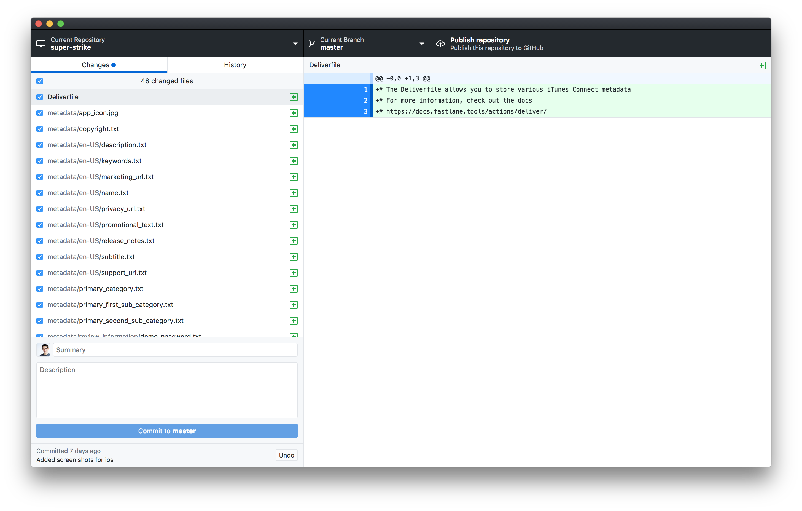
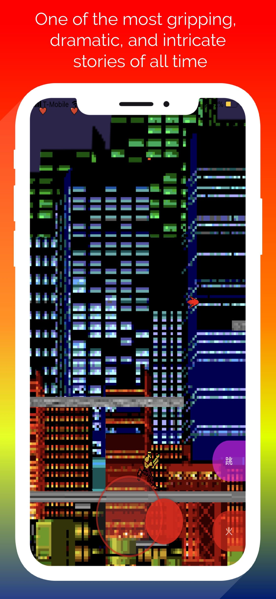
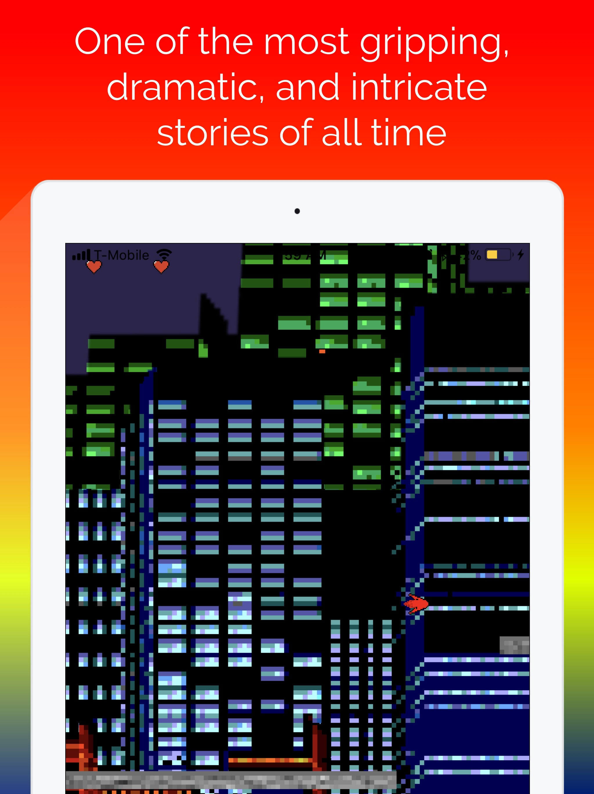

# Manage App Store Metadata in Expo with Fastlane Deliver

import { Embed } from "../../../components/embeds";
import Thanks from "../../../components/thanks.mdx";

## Learn how to use Fastlane deliver with Expo to bring the ancient art of copy-pasting to your App Store metadata.

### TL;DR

Run these two commands in an Expo project:

```sh
fastlane deliver init

fastlane deliver --skip_binary_upload
```

*Heads up this is **requires a Mac.** (Sorry my differently-computable friends *😩😞*.[ It has something to do with Xcode tools](https://github.com/fastlane/fastlane/issues/9823).*😵*)*

## I made a lot of apps irresponsibly before I was old enough to take care of them.

I would make more but I hate having to change gears and do creative writing + filling out form data that I've done a bunch of times before…



## It takes longer to write metadata than it takes to build an Expo app.

But luckily Fastlane provides an awesome tool (or “action”) for us to make this exponentially easier, it's called [deliver](https://docs.fastlane.tools/actions/deliver/). I avoided it in the past because I thought you needed an .xcproject to make it work, but using the right flags will allow us to make this completely Expo-compatible! (_expatible_?? 🤔)



_Match works with existing apps; it'll just download the current data._

Start by [downloading Fastlane](https://docs.fastlane.tools/#getting-started) if you don't already have it.

Then, in an Expo project, run `fastlane deliver init`.

_Also saves any screenshots you made already._

## Now we can easily edit and copy our constant data to other apps.

- trade_representative_contact_information/\*.txt

- copyright.txt

- [en-US]/privacy_url.txt

- [en-US]/marketing_url.txt

- [en-US]/support_url.txt



_Yeah, I'm never going back._

## Now you're free to edit and bulk refactor.

This is especially great for screenshots, as manually uploading them takes forever. Until someone can think of a good way to get Fastlane's screenshot feature working, I recommend using [appure](https://screenshots.appure.io/): it's pretty fast and easy to use.



_Just screenshot your app in ~3 places then appure takes care of the rest_

## **Sync your changes… it'll take a few minutes/**seconds**.**

```sh
fastlane deliver --skip_binary_upload
```

## Also you'll get some really **advantageous** warnings.

```sh
+-----------+----------------+

|     Potential problems     |

+-----------+----------------+

| Field     | Failure reason |

+-----------+----------------+

| copyright | missing: 2018  |

+-----------+----------------+
```

And that's all there is to it! Hopefully this cuts your usage of iTunes Connect ~50% while you continue to build your full suite of My Little Pony workout apps! 🦄

<Thanks />
